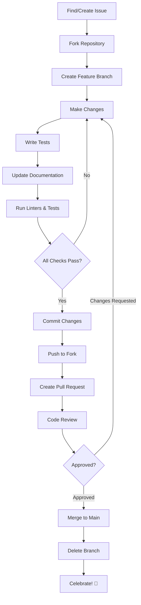

# Contributor Guide

Welcome to the GreenGovRAG contributor guide! This section provides comprehensive documentation for developers who want to contribute to the project.

## Getting Started

New to contributing? Start here:

1. **[Overview](overview.md)** - Read about our contribution process, code of conduct, and ways to contribute
2. **[Development Setup](dev-setup.md)** - Set up your local development environment
3. **[Code Style](code-style.md)** - Learn our coding standards and style guidelines
4. **[Testing](testing.md)** - Understand our testing requirements and practices
5. **[Pull Requests](pull-requests.md)** - Submit your contributions for review

## Quick Links

### For First-Time Contributors

- [Code of Conduct](overview.md#code-of-conduct)
- [Finding Issues to Work On](overview.md#finding-issues-to-work-on)
- [Quick Start Checklist](overview.md#quick-start-checklist)
- [Good First Issues](https://github.com/sdp5/green-gov-rag/issues?q=is%3Aissue+is%3Aopen+label%3A%22good+first+issue%22)

### Development Resources

- [Prerequisites](dev-setup.md#prerequisites)
- [Installation Methods](dev-setup.md#installation-methods)
- [IDE Setup](dev-setup.md#ide-setup)
- [Troubleshooting](dev-setup.md#troubleshooting)

### Code Quality

- [Ruff Configuration](code-style.md#ruff-configuration)
- [MyPy Type Checking](code-style.md#mypy-type-checking)
- [Docstring Standards](code-style.md#docstring-standards)
- [Running Linters](code-style.md#running-tools)

### Testing

- [Writing Unit Tests](testing.md#writing-unit-tests)
- [Writing Integration Tests](testing.md#writing-integration-tests)
- [Running Tests](testing.md#running-tests)
- [Code Coverage](testing.md#code-coverage)

### Submitting Changes

- [Fork and Branch Workflow](pull-requests.md#fork-and-branch-workflow)
- [Commit Message Guidelines](pull-requests.md#commit-message-guidelines)
- [PR Checklist](pull-requests.md#pull-request-checklist)
- [Code Review Process](pull-requests.md#code-review-process)

## Documentation Structure

```
docs/contributor-guide/
├── README.md              # This file - contributor guide overview
├── overview.md            # Contribution overview and code of conduct
├── dev-setup.md           # Local development environment setup
├── code-style.md          # Code style and linting guide
├── testing.md             # Testing guide and best practices
└── pull-requests.md       # Pull request workflow and guidelines
```

## Related Documentation

### User Guides
- [Getting Started](../getting-started/) - Installation and quickstart
- [User Guide](../user-guide/) - Using GreenGovRAG features
- [Reference](../reference/) - API and plugin reference

### Developer Guides
- [Architecture](../developer-guide/architecture/) - System architecture
- [Data Sources](../user-guide/document-sources.md) - Adding document sources
- [Cloud Storage](../developer-guide/cloud-storage.md) - Cloud storage integration
- [Metadata Standards](../developer-guide/metadata-standards.md) - Metadata guidelines

## Contribution Workflow



## Contribution Types

### Code Contributions

**RAG Pipeline**
- Improve retrieval algorithms
- Enhance response generation
- Add new LLM providers
- Optimize vector search

**ETL Pipeline**
- Add document sources ([Plugin Guide](../reference/plugin-api.md))
- Improve parsing accuracy
- Enhance metadata extraction
- Optimize chunking strategy

**API Development**
- New endpoints
- Enhanced filtering
- Better error handling
- Performance optimization

**Testing**
- Increase test coverage
- Add integration tests
- Improve test utilities
- Performance benchmarks

### Documentation Contributions

**User Documentation**
- Getting started guides
- Feature tutorials
- Troubleshooting guides
- FAQ updates

**Developer Documentation**
- Architecture documentation
- API documentation
- Code examples
- Design decisions

**Code Documentation**
- Docstrings
- Inline comments
- Type hints
- README files

### Other Contributions

**Issue Reporting**
- Bug reports
- Feature requests
- Documentation issues
- Performance issues

**Code Review**
- Review pull requests
- Provide feedback
- Test changes
- Suggest improvements

**Community Support**
- Answer questions
- Help new contributors
- Share knowledge
- Improve processes

## Standards and Guidelines

### Code Standards

- **Style**: Follow [Ruff](code-style.md#ruff-configuration) guidelines
- **Types**: Use [type hints](code-style.md#mypy-type-checking) for all functions
- **Docs**: Write [Google-style docstrings](code-style.md#docstring-standards)
- **Tests**: Maintain [70%+ coverage](testing.md#code-coverage)
- **Complexity**: Keep McCabe complexity under 10

### Git Standards

- **Commits**: Follow [conventional commits](pull-requests.md#commit-message-guidelines)
- **Branches**: Use [descriptive names](pull-requests.md#3-create-a-feature-branch)
- **PRs**: Complete [PR template](pull-requests.md#3-pull-request-template)
- **Reviews**: Address all [feedback](pull-requests.md#addressing-feedback)

### Quality Standards

- All tests must pass
- No linting errors
- No type errors
- Documentation updated
- Changelog updated (if applicable)

## Tools and Commands

### Development Tools

```bash
# Format code
ruff format .

# Check linting
ruff check .

# Type checking
mypy green_gov_rag tests

# Run tests
pytest

# Run with coverage
pytest --cov=green_gov_rag
```

### Git Commands

```bash
# Create feature branch
git checkout -b feature/your-feature

# Commit changes
git commit -m "feat(scope): description"

# Push to fork
git push origin feature/your-feature

# Update from upstream
git pull upstream main
git rebase main
```

### Docker Commands

```bash
# Start development environment
docker-compose up -d

# View logs
docker-compose logs -f backend

# Run tests in container
docker-compose exec backend pytest

# Stop services
docker-compose down
```

## Getting Help

### Documentation

- [Troubleshooting Guide](../user-guide/troubleshooting.md)
- [FAQ](../getting-started/quickstart.md)
- [Architecture Docs](../developer-guide/)

### Community

- **GitHub Issues**: Questions and discussions
- **Pull Requests**: Code-specific questions
- **Email**: contact@sundeep.id.au (for sensitive matters)

### Response Times

- Issues: 2-3 business days
- Pull Requests: 3-5 business days
- Security Issues: Within 24 hours

## Recognition

All contributors are recognized in:
- Git commit history
- CONTRIBUTORS.md file
- GitHub contributors page
- Release notes
- Project announcements

## Next Steps

Ready to contribute? Here's what to do next:

1. **Read the [Overview](overview.md)** to understand our contribution process
2. **Set up your [development environment](dev-setup.md)**
3. **Learn the [code style](code-style.md)** guidelines
4. **Understand our [testing](testing.md)** requirements
5. **Find an issue** to work on (start with [good first issues](https://github.com/sdp5/green-gov-rag/issues?q=is%3Aissue+is%3Aopen+label%3A%22good+first+issue%22))
6. **Make your contribution** following the [PR guide](pull-requests.md)

## Questions?

If you have questions not covered in this guide:

1. Check the [Troubleshooting Guide](../user-guide/troubleshooting.md)
2. Search [existing issues](https://github.com/sdp5/green-gov-rag/issues)
3. Create a new issue with the `question` label
4. Contact maintainers at contact@sundeep.id.au

---

**Thank you for contributing to GreenGovRAG!** Your efforts help make Australian environmental and planning regulations more accessible to everyone.

**Happy coding!** 
