# ETL Pipeline Deep Dive

This document provides comprehensive technical details about GreenGovRAG's Extract-Transform-Load (ETL) pipeline, covering document ingestion, parsing, chunking, metadata enrichment, and vector store indexing.

## Table of Contents

- [ETL Architecture](#etl-architecture)
- [Document Ingestion Workflow](#document-ingestion-workflow)
- [PDF Parsing with Unstructured.io](#pdf-parsing-with-unstructuredio)
- [Chunking Strategies](#chunking-strategies)
- [Metadata Tagging](#metadata-tagging)
- [Vector Embedding Generation](#vector-embedding-generation)
- [Database and Vector Store Writing](#database-and-vector-store-writing)
- [Error Handling and Retries](#error-handling-and-retries)
- [Scheduling and Orchestration](#scheduling-and-orchestration)

---

## ETL Architecture

```mermaid
graph TB
    subgraph "1. Source Configuration"
        CONFIG[documents_config.yml<br/>Source Definitions]
        FACTORY[Document Source Factory<br/>Plugin Registry]
        SOURCES[Document Source Plugins<br/>Federal/State/Local]
    end

    subgraph "2. Document Ingestion"
        VALIDATE[Validate Config<br/>Required Fields]
        GENERATE_ID[Generate Document ID<br/>SHA256 Hash]
        DOWNLOAD[Download Document<br/>Retry Logic]
        DETECT_TYPE[Detect File Type<br/>Magic Bytes]
        STORE_RAW[Store Raw File<br/>S3/Azure/Local]
    end

    subgraph "3. Parsing"
        SELECT_PARSER[Select Parser<br/>PDF/HTML/Layout]
        UNSTRUCTURED[Unstructured.io<br/>Hi-Res Parsing]
        EXTRACT_SECTIONS[Extract Sections<br/>Hierarchy Detection]
        EXTRACT_TABLES[Extract Tables<br/>Structure Detection]
        EXTRACT_CLAUSES[Extract Clause Refs<br/>s.3.2.1, cl.42]
    end

    subgraph "4. Chunking"
        RECURSIVE_SPLIT[Recursive Text Split<br/>Paragraph → Sentence]
        PRESERVE_META[Preserve Metadata<br/>Section Hierarchy]
        ADD_CHUNK_ID[Add Chunk IDs<br/>Sequential Integer]
        CALC_OVERLAP[Calculate Overlap<br/>100-200 tokens]
    end

    subgraph "5. Metadata Enrichment"
        LLM_TAGGER[LLM-based Tagger<br/>GPT-4]
        ESG_EXTRACT[Extract ESG Metadata<br/>Scopes, Frameworks]
        SPATIAL_EXTRACT[Extract Spatial<br/>LGA, State, Scope]
        TOPIC_CLASSIFY[Topic Classification<br/>Emissions, Planning]
    end

    subgraph "6. Embedding"
        BATCH_EMBED[Batch Embedding<br/>100 chunks/batch]
        HUGGINGFACE[HuggingFace Model<br/>MiniLM-L6-v2]
        OPENAI_EMBED[OpenAI Embeddings<br/>text-embedding-3-small]
        VECTOR_GEN[Generate Vectors<br/>384/1536 dimensions]
    end

    subgraph "7. Storage"
        DB_BATCH[Batch Database Write<br/>100 chunks/txn]
        POSTGRES[(PostgreSQL<br/>Chunks + Metadata)]
        VECTOR_INDEX[Vector Store Index<br/>FAISS/Qdrant]
        CLOUD_STORAGE[Cloud Storage<br/>Processed Files]
    end

    CONFIG --> FACTORY
    FACTORY --> SOURCES
    SOURCES --> VALIDATE

    VALIDATE --> GENERATE_ID
    GENERATE_ID --> DOWNLOAD
    DOWNLOAD --> DETECT_TYPE
    DETECT_TYPE --> STORE_RAW

    STORE_RAW --> SELECT_PARSER
    SELECT_PARSER --> UNSTRUCTURED
    UNSTRUCTURED --> EXTRACT_SECTIONS
    EXTRACT_SECTIONS --> EXTRACT_TABLES
    EXTRACT_TABLES --> EXTRACT_CLAUSES

    EXTRACT_CLAUSES --> RECURSIVE_SPLIT
    RECURSIVE_SPLIT --> PRESERVE_META
    PRESERVE_META --> ADD_CHUNK_ID
    ADD_CHUNK_ID --> CALC_OVERLAP

    CALC_OVERLAP --> LLM_TAGGER
    LLM_TAGGER --> ESG_EXTRACT
    ESG_EXTRACT --> SPATIAL_EXTRACT
    SPATIAL_EXTRACT --> TOPIC_CLASSIFY

    TOPIC_CLASSIFY --> BATCH_EMBED
    BATCH_EMBED --> HUGGINGFACE
    BATCH_EMBED --> OPENAI_EMBED
    HUGGINGFACE --> VECTOR_GEN
    OPENAI_EMBED --> VECTOR_GEN

    VECTOR_GEN --> DB_BATCH
    DB_BATCH --> POSTGRES
    DB_BATCH --> VECTOR_INDEX
    DB_BATCH --> CLOUD_STORAGE

    style CONFIG fill:#4CAF50
    style UNSTRUCTURED fill:#FF9800
    style LLM_TAGGER fill:#F44336
    style VECTOR_GEN fill:#2196F3
    style POSTGRES fill:#9C27B0
```



---

## Document Ingestion Workflow

### 1. Source Configuration

**Location**: `/backend/configs/documents_config.yml`

**Configuration Schema**:
```yaml
documents:
  - title: "NGER Act Explanatory Guide"
    source_url: "https://www.cleanenergyregulator.gov.au"
    jurisdiction: "federal"
    category: "environment"
    topic: "emissions_reporting"
    region: "Australia"
    download_urls:
      - "https://www.cleanenergyregulator.gov.au/NGER/Published-information/publications/fact-sheets/nger-guide.pdf"

    # ESG metadata (optional - can be auto-tagged)
    esg_metadata:
      frameworks:
        - "NGER"
        - "GHG_Protocol"
      emission_scopes:
        - "scope_1"
        - "scope_2"
      greenhouse_gases:
        - "CO2"
        - "CH4"
        - "N2O"
      reportable_under_nger: true
      regulatory_authority: "Clean Energy Regulator"

    # Spatial metadata (optional)
    spatial_metadata:
      spatial_scope: "federal"
      state: null
      lga_codes: []
```

### 2. Document ID Generation

**Module**: `/backend/green_gov_rag/etl/db_writer.py`

**ID Algorithm**:
```python
def create_document_id(source_url: str, title: str) -> str:
    """Generate unique document ID from URL and title.

    Uses MD5 hash for deterministic IDs (enables delta indexing).
    """
    content = f"{source_url}::{title}"
    return hashlib.md5(content.encode()).hexdigest()[:16]
```

**Benefits**:

- **Deterministic**: Same document always gets same ID
- **Collision-resistant**: MD5 provides 128-bit uniqueness
- **Delta indexing**: Only reprocess documents that changed
- **Idempotent**: Safe to re-run without duplicates

### 3. Document Download

**Module**: `/backend/green_gov_rag/etl/ingest.py`

**Download Logic**:
```python
def download_file(
    url: str,
    dest_path: str,
    retries: int = 3,
    backoff: int = 2
) -> bool:
    """Download file with exponential backoff retry logic."""
    attempt = 0

    while attempt < retries:
        try:
            resp = requests.get(
                url,
                timeout=30,
                headers={
                    "User-Agent": "Mozilla/5.0 (Windows NT 10.0; Win64; x64) AppleWebKit/537.36",
                    "Accept": "application/pdf,text/html,*/*"
                },
                allow_redirects=True
            )

            # Check for Cloudflare bot protection
            if resp.status_code in (403, 503):
                if "cloudflare" in resp.headers.get("Server", "").lower():
                    logger.warning(f"Cloudflare protection detected for {url}")
                    return False  # Don't retry Cloudflare-protected URLs

            resp.raise_for_status()

            # Save file
            with open(dest_path, "wb") as f:
                f.write(resp.content)

            return True

        except Exception as e:
            attempt += 1
            logger.error(f"Download failed (attempt {attempt}): {e}")

            if attempt < retries:
                time.sleep(backoff ** attempt)  # Exponential backoff

    return False
```

**Error Handling**:

- **HTTP 403/503**: Detect Cloudflare protection and skip retries
- **Timeout**: 30 seconds per request
- **Retries**: 3 attempts with exponential backoff (2s, 4s, 8s)
- Failed downloads logged to `logs/failed_downloads.txt`

### 4. File Type Detection

**Magic Byte Detection**:
```python
def detect_file_type(file_path: Path) -> str | None:
    """Detect file type from magic bytes (not extension)."""
    with open(file_path, "rb") as f:
        header = f.read(16)

    # PDF: %PDF-1.4
    if header.startswith(b"%PDF"):
        return ".pdf"

    # HTML: <html, <!doctype, <head
    with open(file_path, "rb") as f:
        content = f.read(1024).lower()
        if any(tag in content for tag in [b"<html", b"<!doctype", b"<head"]):
            return ".html"

    # XML
    if header.startswith(b"<?xml"):
        return ".xml"

    return None
```

**Auto-Correction**:
```python
# Example: File downloaded as "document" but is actually PDF
detected_ext = detect_file_type(dest_path)

if detected_ext and not filename.endswith(detected_ext):
    # Rename: "document" → "document.pdf"
    final_path = dest_path.parent / f"{filename}{detected_ext}"
    dest_path.rename(final_path)
    logger.info(f"Renamed {filename} → {final_path.name}")
```

### 5. Cloud Storage Upload

**Module**: `/backend/green_gov_rag/etl/storage_adapter.py`

**Storage Abstraction**:
```python
class ETLStorageAdapter:
    def __init__(self):
        provider = settings.cloud_provider

        if provider == "aws":
            self.storage = S3Storage()
        elif provider == "azure":
            self.storage = AzureBlobStorage()
        else:
            self.storage = LocalFileStorage()

    def save_raw_document(self, doc_id: str, file_path: str) -> str:
        """Save raw document to storage."""
        key = f"raw/{doc_id}/document.pdf"
        return self.storage.upload(file_path, key)

    def save_chunks(self, chunks: list[dict], doc_id: str) -> str:
        """Save processed chunks to storage."""
        key = f"processed/{doc_id}/chunks.json"
        data = json.dumps(chunks)
        return self.storage.upload_string(data, key)
```

---

## PDF Parsing with Unstructured.io

### 1. Parser Selection

**Module**: `/backend/green_gov_rag/etl/parsers/unstructured_parser.py`

**Parsing Strategies**:

| Strategy | Speed | Accuracy | Use Case |
|----------|-------|----------|----------|
| `hi_res` | Slow (5-10s/page) | High | Regulatory documents, complex layouts |
| `fast` | Fast (0.5s/page) | Medium | Simple PDFs, text-heavy documents |
| `auto` | Medium | Medium-High | Automatic selection based on complexity |

**Recommended**: `hi_res` for regulatory documents with tables and hierarchical sections.

### 2. Hierarchical Structure Extraction

**Section Hierarchy Detection**:
```python
class UnstructuredPDFParser:
    def parse_with_structure(self, pdf_path: str) -> list[dict]:
        """Extract chunks with hierarchical metadata."""

        # Parse with Unstructured.io
        elements = partition_pdf(
            str(pdf_path),
            strategy="hi_res",
            infer_table_structure=True,  # Extract tables
            include_page_breaks=True,    # Track page numbers
            extract_images_in_pdf=False  # Skip images (for now)
        )

        section_stack = []  # Track current position in hierarchy
        chunks = []

        for idx, element in enumerate(elements):
            element_type = element.category  # Title, NarrativeText, Table, etc.
            text = str(element)
            page_number = element.metadata.page_number if element.metadata else None

            # Update section hierarchy for headings
            if element_type == "Title":
                level = self._infer_heading_level(text)
                self._update_section_stack(section_stack, text, level)

            # Build chunk with hierarchy
            chunk = {
                "content": text,
                "metadata": {
                    "chunk_id": idx,
                    "chunk_type": self._map_element_type(element_type),
                    "page_number": page_number,
                    "section_hierarchy": section_stack.copy(),
                    "section_title": section_stack[-1] if section_stack else "",
                    "section_level": len(section_stack),
                    "clause_reference": self._extract_clause_reference(text, section_stack)
                }
            }

            chunks.append(chunk)

        return chunks
```

**Heading Level Inference**:
```python
def _infer_heading_level(self, text: str) -> int:
    """Infer heading level from text patterns."""
    # Numbered sections: "1.2.3" → level 3
    match = re.match(r"^(\d+(?:\.\d+)*)", text)
    if match:
        levels = match.group(1).count(".") + 1
        return min(levels, 6)

    # Keywords: "Chapter" → level 1, "Section" → level 2
    if re.match(r"^(Chapter|Part)\s+", text, re.IGNORECASE):
        return 1
    if re.match(r"^Section\s+", text, re.IGNORECASE):
        return 2

    # All caps headings: Usually level 2
    if text.isupper() and len(text) < 100:
        return 2

    return 3  # Default
```

### 3. Clause Reference Extraction

**Supported Formats**:

- **Section numbers**: `3.2.1` → `s.3.2.1`
- **Clauses**: `Clause 42` → `cl.42`
- **Subsections**: `5(2)(a)` → `s.5(2)(a)`
- **Regulations**: `Regulation 12` → `reg.12`
- **Schedules**: `Schedule 1` → `sch.1`
- **Parts**: `Part IV` → `part.IV`

**Extraction Logic**:
```python
def _extract_clause_reference(self, text: str, section_hierarchy: list[str]) -> str | None:
    """Extract clause/section reference from text."""

    # Pattern 1: Section numbers with brackets
    match = re.search(
        r"(?:section|s\.?)\s*(\d+(?:\.\d+)*(?:\([a-z0-9]+\))*)",
        text,
        re.IGNORECASE
    )
    if match:
        return f"s.{match.group(1)}"

    # Pattern 2: Clause references
    match = re.search(r"(?:clause|cl\.?)\s*(\d+)", text, re.IGNORECASE)
    if match:
        return f"cl.{match.group(1)}"

    # Pattern 3: Regulation references
    match = re.search(r"(?:regulation|reg\.?)\s*(\d+)", text, re.IGNORECASE)
    if match:
        return f"reg.{match.group(1)}"

    # Fallback: Check section hierarchy
    if section_hierarchy:
        return self._extract_clause_from_text(section_hierarchy[-1])

    return None
```

### 4. Table Detection and Association

**Table Extraction**:
```python
# Unstructured.io automatically detects tables
elements = partition_pdf(pdf_path, infer_table_structure=True)

for element in elements:
    if element.category == "Table":
        # Extract table as HTML or structured data
        table_html = element.metadata.text_as_html

        # Associate table with current section
        chunk = {
            "content": element.text,
            "metadata": {
                "chunk_type": "table",
                "table_html": table_html,
                "section_hierarchy": section_stack.copy()
            }
        }
```

**Table Formatting**:

- Convert to markdown for LLM consumption
- Preserve headers and cell structure
- Link to parent section for context

---

## Chunking Strategies

### 1. Recursive Character Splitting

**Module**: `/backend/green_gov_rag/etl/chunker.py`

**Algorithm**:
```python
class TextChunker:
    def __init__(self, chunk_size: int = 1000, chunk_overlap: int = 100):
        self.splitter = RecursiveCharacterTextSplitter(
            chunk_size=chunk_size,
            chunk_overlap=chunk_overlap,
            separators=["\n\n", "\n", " ", ""]  # Paragraph → sentence → word
        )

    def chunk_text(self, text: str) -> list[str]:
        """Split text into chunks."""
        return self.splitter.split_text(text)
```

**Separator Priority**:

1. `\n\n` - Paragraph breaks (preferred)
2. `\n` - Line breaks
3. ` ` - Word boundaries
4. `""` - Character-level (last resort)

### 2. Hierarchical Chunking

**Preserve Section Metadata**:
```python
def chunk_with_hierarchy(self, hierarchical_chunks: list[dict]) -> list[dict]:
    """Chunk while preserving section hierarchy."""
    chunked_docs = []
    global_chunk_id = 0

    for doc_chunk in hierarchical_chunks:
        content = doc_chunk["content"]
        metadata = doc_chunk["metadata"]

        # Split content into smaller chunks
        text_chunks = self.chunk_text(content)

        for i, text_chunk in enumerate(text_chunks):
            chunked_docs.append({
                "content": text_chunk,
                "metadata": {
                    **metadata,  # Preserve all hierarchical metadata
                    "original_chunk_id": metadata.get("chunk_id"),
                    "sub_chunk_id": i,
                    "chunk_id": global_chunk_id  # Global sequential ID
                }
            })
            global_chunk_id += 1

    return chunked_docs
```

**Chunk Size Optimization**:

| Chunk Size | Pros | Cons | Use Case |
|------------|------|------|----------|
| 500 tokens | Precise retrieval | More chunks to index | Short answers, definitions |
| 1000 tokens | Balanced | Default | General regulatory queries |
| 1500 tokens | More context | Less precise retrieval | Complex procedures |

**Overlap Calculation**:
```python
chunk_overlap = min(chunk_overlap, chunk_size - 1)  # Prevent overlap > size

# Example: chunk_size=1000, chunk_overlap=100
# Chunk 1: chars 0-1000
# Chunk 2: chars 900-1900 (100 chars overlap)
# Chunk 3: chars 1800-2800
```

### 3. Semantic Chunking (Future)

**Planned Enhancement**:
```python
# Use sentence embeddings to chunk by semantic similarity
from langchain.text_splitter import SemanticChunker

chunker = SemanticChunker(
    embeddings=embedder,
    breakpoint_threshold_type="percentile",
    breakpoint_threshold_amount=0.75
)

chunks = chunker.split_text(text)
```

---

## Metadata Tagging

### 1. LLM-based Auto-Tagging

**Module**: `/backend/green_gov_rag/etl/metadata_tagger.py`

**ESG Metadata Schema**:
```python
class ESGMetadata(BaseModel):
    emission_scopes: list[str]          # scope_1, scope_2, scope_3
    scope_3_categories: list[str]       # upstream_transport, business_travel, etc.
    greenhouse_gases: list[str]         # CO2, CH4, N2O, SF6, HFCs, PFCs, NF3
    frameworks: list[str]               # NGER, ISSB, GHG_Protocol, GRI, TCFD
    consolidation_method: str | None    # operational_control, equity_share, financial_control
    methodology_type: str | None        # calculation, reporting, verification
    activity_types: list[str]           # fuel_combustion, electricity_consumption, etc.
    facility_types: list[str]           # coal_mine, power_station, manufacturing
    industry_applicability: list[str]   # ANZSIC codes: B0600 (Coal Mining), etc.
    regulatory_authority: str | None    # Clean Energy Regulator, NSW EPA, etc.
    reportable_under_nger: bool | None  # NGER reporting requirement
```

**Tagging Implementation**:
```python
class ESGOpenAITagger:
    def __init__(self, model_name: str = "gpt-4", temperature: float = 0.0):
        self.llm = ChatOpenAI(model=model_name, temperature=temperature)
        self.chain = create_tagging_chain_pydantic(
            pydantic_schema=ESGMetadata,
            llm=self.llm
        )

    def tag_document(self, document: Document) -> Document:
        """Tag single document with ESG metadata."""
        # Extract metadata using LLM
        result = self.chain.run(document.page_content)

        # Merge with existing metadata
        document.metadata["esg_metadata"] = result.dict()

        return document

    def tag_all(self, documents: list[Document], batch_size: int = 10) -> list[Document]:
        """Tag multiple documents in batches."""
        tagged_docs = []

        for i in range(0, len(documents), batch_size):
            batch = documents[i:i + batch_size]

            for doc in batch:
                tagged_doc = self.tag_document(doc)
                tagged_docs.append(tagged_doc)

            # Rate limiting: Avoid OpenAI throttling
            if i + batch_size < len(documents):
                time.sleep(1)  # 1 second between batches

        return tagged_docs
```

**Prompt Example** (internal to LangChain):
```text
Extract ESG metadata from the following text:

Text:
"NGER requires reporting of Scope 1 emissions from facilities exceeding 25,000 tonnes CO2-e annually..."

Extract:
- emission_scopes: Which scopes are mentioned?
- greenhouse_gases: Which gases (CO2, CH4, N2O, etc.)?
- frameworks: Which standards (NGER, ISSB, GHG_Protocol)?
- reportable_under_nger: Is this reportable under NGER?
...

Output as JSON matching ESGMetadata schema.
```

### 2. Spatial Metadata Tagging

**Automatic Detection**:
```python
def tag_spatial_metadata(document: Document) -> Document:
    """Tag spatial scope and location."""
    content = document.page_content.lower()

    # Detect spatial scope
    if any(kw in content for kw in ["federal", "national", "commonwealth"]):
        spatial_scope = "federal"
    elif any(state in content for state in ["sa", "nsw", "vic", "qld", "wa"]):
        spatial_scope = "state"
    elif any(kw in content for kw in ["council", "lga", "city of", "shire of"]):
        spatial_scope = "local"
    else:
        spatial_scope = "unknown"

    # Extract state
    state_match = re.search(r"\b(SA|NSW|VIC|QLD|WA|TAS|NT|ACT)\b", document.page_content)
    state = state_match.group(1) if state_match else None

    # Extract LGA codes (if mentioned)
    lga_codes = []
    # ... LGA extraction logic using LocationNER

    document.metadata["spatial_metadata"] = {
        "spatial_scope": spatial_scope,
        "state": state,
        "lga_codes": lga_codes
    }

    return document
```

---

## Vector Embedding Generation

### 1. Batch Embedding

**Module**: `/backend/green_gov_rag/rag/embeddings.py`

**Batching Strategy**:
```python
def embed_chunks(self, chunks: list[dict], batch_size: int = 100) -> list[dict]:
    """Generate embeddings with batching for performance."""
    embedded_chunks = []

    # Filter empty chunks
    valid_chunks = [c for c in chunks if c.get("content", "").strip()]

    total_batches = (len(valid_chunks) + batch_size - 1) // batch_size

    for i in range(0, len(valid_chunks), batch_size):
        batch = valid_chunks[i:i + batch_size]
        batch_num = i // batch_size + 1

        # Extract texts
        texts = [chunk["content"] for chunk in batch]

        # Batch embed (single API call for entire batch)
        vectors = self.embedder.embed_documents(texts)

        # Combine with metadata
        for chunk, vector in zip(batch, vectors):
            embedded_chunks.append({
                "content": chunk["content"],
                "metadata": chunk.get("metadata", {}),
                "embedding": vector
            })

        # Progress logging
        if batch_num % 10 == 0:
            print(f"Embedded batch {batch_num}/{total_batches}")

    return embedded_chunks
```

**Performance**:

- **HuggingFace (local)**: ~300 embeddings/second (CPU)
- **HuggingFace (GPU)**: ~3000 embeddings/second
- **OpenAI API**: ~1000 embeddings/second (rate limited)

### 2. Model Selection

**Embedding Model Comparison**:

| Model | Dimensions | Max Tokens | Performance | Use Case |
|-------|------------|------------|-------------|----------|
| all-MiniLM-L6-v2 | 384 | 512 | Fast | Default (local dev) |
| all-mpnet-base-v2 | 768 | 512 | Slower, more accurate | Better retrieval quality |
| text-embedding-3-small | 1536 | 8192 | API-based | Production (OpenAI) |
| text-embedding-3-large | 3072 | 8192 | API-based | Highest accuracy |

**Configuration**:
```python
# Local development (default)
embedder = ChunkEmbedder(
    provider="huggingface",
    model_name="sentence-transformers/all-MiniLM-L6-v2"
)

# Production (OpenAI)
embedder = ChunkEmbedder(
    provider="openai",
    model_name="text-embedding-3-small"
)
```

---

## Database and Vector Store Writing

### 1. Database Schema

**Tables**:

- `document_sources`: Document source configurations (1:many with files)
- `document_files`: Individual PDF files
- `document_chunks`: Text chunks with embeddings
- `document_versions`: Version tracking for delta indexing

**Batch Insertion**:
```python
def save_chunks(chunks: list[dict], batch_size: int = 100):
    """Save chunks to PostgreSQL in batches."""
    with Session(engine) as session:
        for i in range(0, len(chunks), batch_size):
            batch = chunks[i:i + batch_size]

            # Create Chunk objects
            chunk_objects = []
            for chunk_data in batch:
                chunk_obj = Chunk(
                    id=generate_uuid(),
                    document_id=chunk_data["metadata"]["document_id"],
                    content=chunk_data["content"],
                    metadata_=chunk_data["metadata"],
                    embedding=chunk_data.get("embedding"),
                    chunk_index=chunk_data["metadata"]["chunk_id"]
                )
                chunk_objects.append(chunk_obj)

            # Batch insert
            session.add_all(chunk_objects)
            session.commit()

            logger.info(f"Saved batch {i // batch_size + 1}")
```

### 2. Vector Store Indexing

**FAISS Indexing**:
```python
def build_faiss_index(embedded_chunks: list[dict]):
    """Build FAISS index from embedded chunks."""
    import faiss
    import numpy as np

    # Extract embeddings
    embeddings = np.array([c["embedding"] for c in embedded_chunks]).astype("float32")
    dimension = embeddings.shape[1]

    # Create HNSW index (approximate nearest neighbor)
    index = faiss.IndexHNSWFlat(dimension, 32)  # M=32 edges per node
    index.hnsw.efConstruction = 100  # Construction time accuracy

    # Add vectors
    index.add(embeddings)

    # Save index
    faiss.write_index(index, "faiss_index/index.faiss")

    # Save metadata separately
    metadata = [c["metadata"] for c in embedded_chunks]
    with open("faiss_index/metadata.json", "w") as f:
        json.dump(metadata, f)
```

**Qdrant Indexing**:
```python
def build_qdrant_index(embedded_chunks: list[dict]):
    """Build Qdrant collection from embedded chunks."""
    from qdrant_client import QdrantClient
    from qdrant_client.models import Distance, VectorParams, PointStruct

    client = QdrantClient(url="http://localhost:6333")

    # Create collection
    client.recreate_collection(
        collection_name="greengovrag",
        vectors_config=VectorParams(size=384, distance=Distance.COSINE),
    )

    # Batch upsert
    points = []
    for i, chunk in enumerate(embedded_chunks):
        point = PointStruct(
            id=i,
            vector=chunk["embedding"],
            payload=chunk["metadata"]
        )
        points.append(point)

        # Upsert in batches of 100
        if len(points) >= 100:
            client.upsert(collection_name="greengovrag", points=points)
            points = []

    # Upsert remaining
    if points:
        client.upsert(collection_name="greengovrag", points=points)
```

---

## Error Handling and Retries

### 1. Download Failures

**Retry Logic**:
```python
def download_with_retry(url: str, dest_path: str) -> bool:
    """Download with exponential backoff."""
    retries = 3
    backoff = 2

    for attempt in range(retries):
        try:
            response = requests.get(url, timeout=30)
            response.raise_for_status()

            with open(dest_path, "wb") as f:
                f.write(response.content)

            return True

        except requests.exceptions.HTTPError as e:
            if e.response.status_code in (403, 503):
                # Don't retry bot protection
                logger.error(f"Access denied: {url}")
                return False

            logger.warning(f"HTTP error (attempt {attempt + 1}): {e}")

        except Exception as e:
            logger.warning(f"Download error (attempt {attempt + 1}): {e}")

        # Exponential backoff: 2s, 4s, 8s
        if attempt < retries - 1:
            time.sleep(backoff ** (attempt + 1))

    return False
```

### 2. Parsing Failures

**Fallback Strategy**:
```python
try:
    # Try hi_res strategy first
    chunks = parser.parse_with_structure(pdf_path, strategy="hi_res")
except Exception as e:
    logger.warning(f"Hi-res parsing failed: {e}")

    try:
        # Fallback to fast strategy
        chunks = parser.parse_with_structure(pdf_path, strategy="fast")
    except Exception as e:
        logger.error(f"Fast parsing failed: {e}")

        # Final fallback: Simple PyPDF loader
        loader = PyPDFLoader(pdf_path)
        pages = loader.load()
        chunks = [{"content": p.page_content, "metadata": p.metadata} for p in pages]
```

### 3. Database Transaction Rollback

```python
def save_chunks_with_rollback(chunks: list[dict]):
    """Save chunks with transaction rollback on error."""
    with Session(engine) as session:
        try:
            # Begin transaction
            for chunk in chunks:
                chunk_obj = Chunk(**chunk)
                session.add(chunk_obj)

            # Commit transaction
            session.commit()
            logger.info(f"Saved {len(chunks)} chunks")

        except Exception as e:
            # Rollback on error
            session.rollback()
            logger.error(f"Database error: {e}")
            raise
```

---

## Scheduling and Orchestration

### 1. GitHub Actions (Production)

**Workflow**: `.github/workflows/etl-scheduled.yml`

```yaml
name: ETL Scheduled Pipeline

on:
  schedule:
    - cron: '0 2 * * *'  # Daily at 2 AM UTC
  workflow_dispatch:     # Manual trigger

jobs:
  etl:
    runs-on: ubuntu-latest
    steps:
      - uses: actions/checkout@v3

      - name: Set up Python
        uses: actions/setup-python@v4
        with:
          python-version: '3.12'

      - name: Install dependencies
        run: |
          cd backend
          pip install -e .

      - name: Run ETL pipeline
        env:
          DATABASE_URL: ${{ secrets.DATABASE_URL }}
          OPENAI_API_KEY: ${{ secrets.OPENAI_API_KEY }}
          AWS_ACCESS_KEY_ID: ${{ secrets.AWS_ACCESS_KEY_ID }}
          AWS_SECRET_ACCESS_KEY: ${{ secrets.AWS_SECRET_ACCESS_KEY }}
        run: |
          cd backend
          python -m green_gov_rag.etl.pipeline
```

### 2. Airflow (Local Development)

**DAG**: `/backend/green_gov_rag/airflow/dags/greengovrag_pipeline.py`

```python
from airflow import DAG
from airflow.operators.python import PythonOperator
from datetime import datetime, timedelta

default_args = {
    'owner': 'greengovrag',
    'retries': 2,
    'retry_delay': timedelta(minutes=5)
}

dag = DAG(
    'greengovrag_full_pipeline',
    default_args=default_args,
    schedule_interval='@daily',
    start_date=datetime(2024, 1, 1)
)

def ingest_documents():
    from green_gov_rag.etl.ingest import ingest_documents
    ingest_documents()

def process_documents():
    from green_gov_rag.etl.pipeline import EnhancedETLPipeline
    pipeline = EnhancedETLPipeline()
    pipeline.run()

def build_index():
    from green_gov_rag.rag.vector_store import VectorStore
    store = VectorStore()
    store.build_store_from_db()

ingest_task = PythonOperator(
    task_id='ingest_documents',
    python_callable=ingest_documents,
    dag=dag
)

process_task = PythonOperator(
    task_id='process_documents',
    python_callable=process_documents,
    dag=dag
)

index_task = PythonOperator(
    task_id='build_index',
    python_callable=build_index,
    dag=dag
)

ingest_task >> process_task >> index_task
```

### 3. Manual Execution

**CLI**:
```bash
# Full pipeline
python -m green_gov_rag.etl.pipeline

# Individual steps
python -m green_gov_rag.etl.ingest          # Download documents
python -m green_gov_rag.etl.chunker         # Chunk documents
python -m green_gov_rag.rag.embeddings      # Generate embeddings
```

---

## Next Steps

1. **Customize Parsers**: See [../custom-parsers.md](../custom-parsers.md) for parser development
2. **Customize Embeddings**: See [../custom-embeddings.md](../custom-embeddings.md) for embedding models
3. **LLM Configuration**: See [../llm-config.md](../llm-config.md) for metadata tagging setup
4. **Deployment**: See `/deploy/` for production deployment guides

---

**Last Updated**: 2025-11-22
