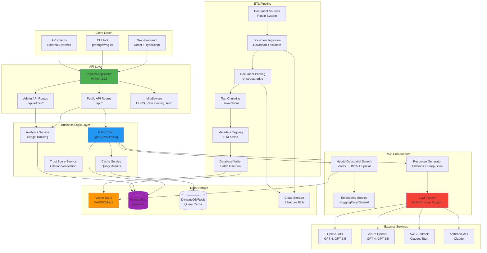
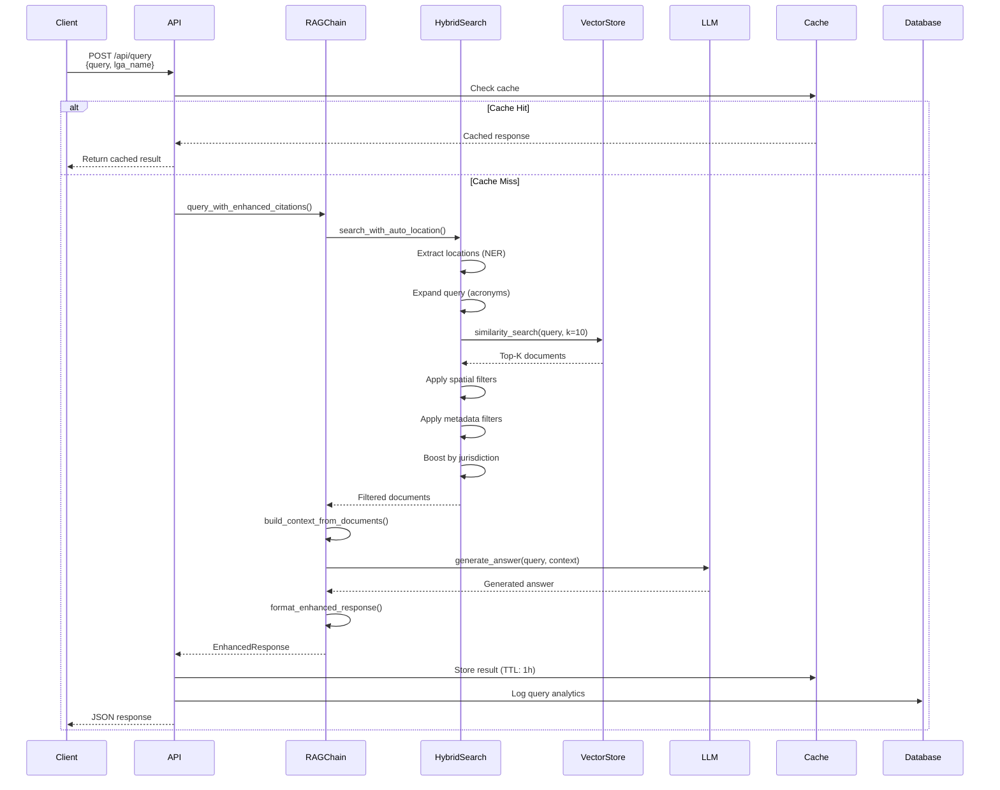
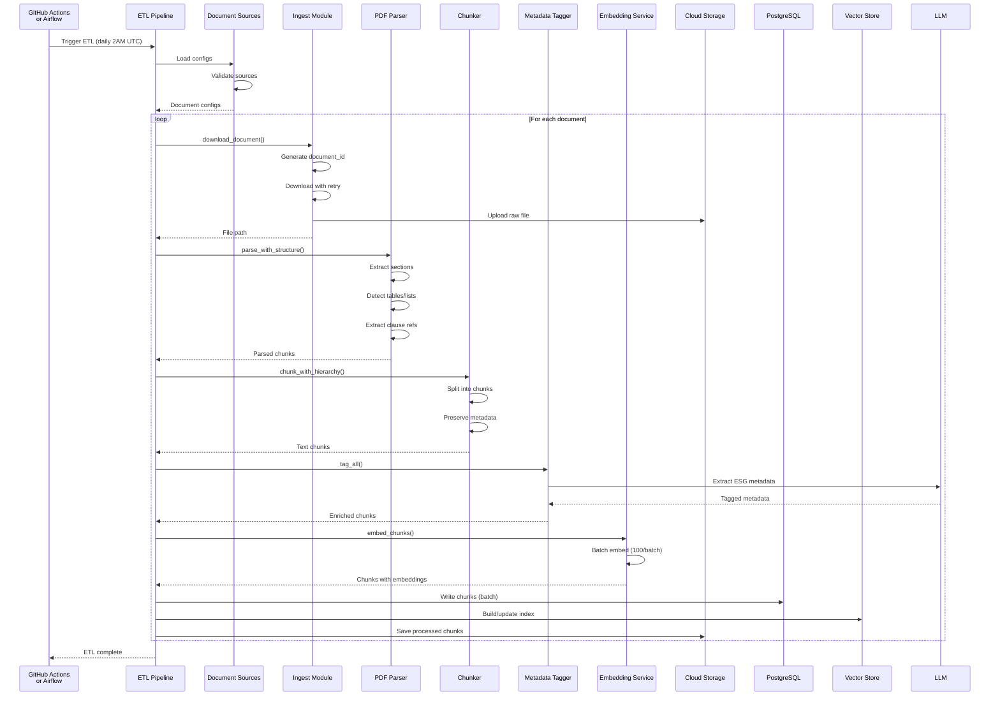
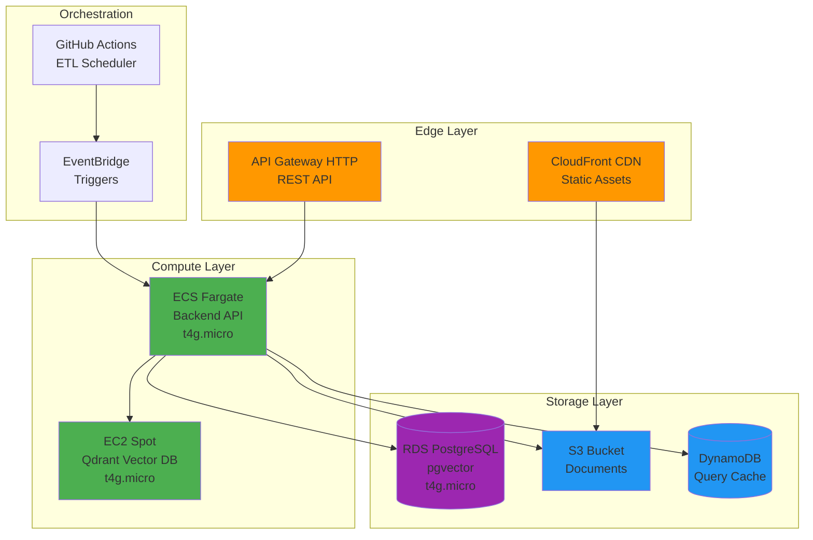
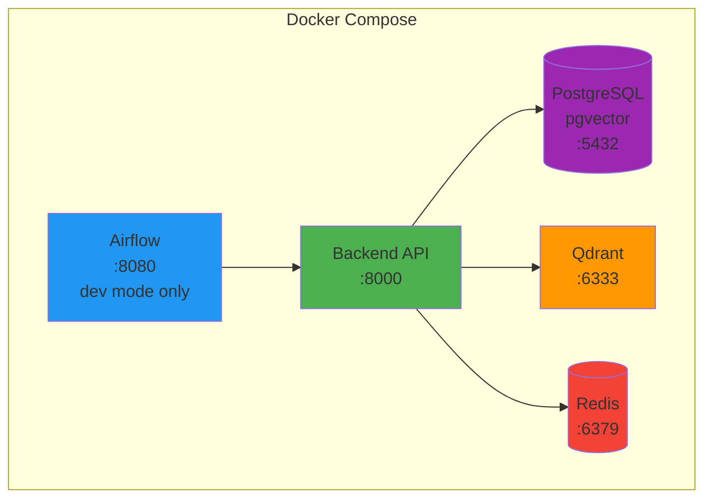

# System Architecture Overview

This document provides a comprehensive overview of GreenGovRAG's system architecture, component design, and data flow patterns.

## Table of Contents

- [Architecture Diagram](#architecture-diagram)
- [System Components](#system-components)
- [Data Flow](#data-flow)
- [Technology Stack](#technology-stack)
- [Design Patterns](#design-patterns)
- [Deployment Architecture](#deployment-architecture)
- [Cross-References](#cross-references)

---

## Architecture Diagram



---

## System Components

### 1. API Layer

#### FastAPI Application
- **Location**: `/backend/green_gov_rag/api/main.py`
- **Purpose**: REST API server for query processing and document management
- **Key Features**:
    - OpenAPI/Swagger documentation at `/docs`
    - CORS middleware for cross-origin requests
    - Rate limiting (30 requests/minute default)
    - Request/response validation with Pydantic
    - Health check endpoints

#### Public API Routes
- **Location**: `/backend/green_gov_rag/api/routes/`
- **Endpoints**:
    - `POST /api/query` - RAG query with optional location filtering
    - `GET /api/documents` - List available documents
    - `GET /api/analytics` - Usage statistics
    - `GET /api/lga-boundaries` - GeoJSON data for LGAs
    - `GET /api/health` - Health check

#### Admin API Routes
- **Location**: `/backend/green_gov_rag/api/admin/`
- **Endpoints**:
    - Document CRUD operations
    - Analytics dashboard data
    - System health monitoring
    - Reprocessing triggers
    - Cache management

### 2. RAG Components

#### RAG Chain
- **Location**: `/backend/green_gov_rag/rag/rag_chain.py`
- **Responsibilities**:
    - Orchestrates end-to-end RAG pipeline
    - Document retrieval coordination
    - Context building from retrieved documents
    - LLM prompt construction and invocation
    - Response formatting with citations
- **Key Methods**:
    - `retrieve_documents()` - Vector similarity search with filters
    - `generate_answer()` - LLM-based answer generation
    - `query_with_sources()` - Complete RAG query with source attribution
    - `query_with_enhanced_citations()` - Advanced citation formatting

#### Hybrid Geospatial Search
- **Location**: `/backend/green_gov_rag/rag/hybrid_search.py`
- **Features**:
    - Vector similarity search (semantic)
    - BM25 lexical search
    - Spatial filtering by LGA, state, coordinates
    - Hierarchical jurisdiction filtering (federal → state → local)
    - Metadata filtering (ESG, category, topic)
    - Query expansion (acronym resolution)
    - Automatic location extraction via NER
- **Search Strategies**:
    - `search()` - Combined hybrid search
    - `search_with_lga()` - LGA-specific search
    - `search_with_esg_filters()` - ESG metadata filtering
    - `search_with_auto_location()` - Automatic NER-based location detection
    - `advanced_search()` - Multi-filter combination

#### Embedding Service
- **Location**: `/backend/green_gov_rag/rag/embeddings.py`
- **Supported Providers**:
    - HuggingFace Transformers (default: `sentence-transformers/all-MiniLM-L6-v2`)
    - OpenAI Embeddings (`text-embedding-3-small`, `text-embedding-3-large`)
    - AWS Bedrock Embeddings
- **Capabilities**:
    - Batch embedding generation (default: 100 chunks/batch)
    - Progress tracking for large datasets
    - Empty chunk filtering
    - Dimension: 384 (MiniLM) or 1536 (OpenAI)

#### LLM Factory
- **Location**: `/backend/green_gov_rag/rag/llm_factory.py`
- **Supported Providers**:
    - **OpenAI**: GPT-4, GPT-4-turbo, GPT-3.5-turbo, GPT-4o
    - **Azure OpenAI**: Same models via Azure deployment
    - **AWS Bedrock**: Claude, Titan, Llama models
    - **Anthropic**: Claude 3 Opus, Sonnet, Haiku
- **Configuration Parameters**:
    - `temperature` - Sampling randomness (0.0-1.0)
    - `max_tokens` - Maximum response length
    - `model` - Specific model name/ID
    - Provider-specific credentials via environment variables

#### Response Generator
- **Location**: `/backend/green_gov_rag/rag/enhanced_response.py`
- **Features**:
    - Inline citation markers `[1]`, `[2]`, etc.
    - Deep links to PDF pages (`#page=N`)
    - Section path display (e.g., "Section 2.1.3: Thresholds")
    - Hierarchical breadcrumbs (Document > Section > Subsection)
    - Confidence scoring for citations
    - Markdown and JSON output formats

### 3. Vector Storage

#### Vector Store Interface
- **Location**: `/backend/green_gov_rag/rag/vector_store_interface.py`
- **Abstraction**: Unified interface for multiple vector stores
- **Implementations**:
    - **FAISS** (local development): Fast, in-memory index
    - **Qdrant** (production): Distributed vector database with filters

#### FAISS Store
- **Location**: `/backend/green_gov_rag/rag/stores/faiss_store.py`
- **Pros**:
    - No external dependencies
    - Fast for small-to-medium datasets (<1M vectors)
    - Simple setup
- **Cons**:
    - In-memory only (limited scalability)
    - No distributed support
    - Limited metadata filtering

#### Qdrant Store
- **Location**: `/backend/green_gov_rag/rag/stores/qdrant_store.py`
- **Pros**:
    - Distributed architecture (scalable to billions of vectors)
    - Advanced metadata filtering
    - Persistent storage
    - HNSW index for sub-linear search
- **Cons**:
    - Requires external service
    - More complex deployment

### 4. ETL Pipeline

#### Document Sources (Plugin System)
- **Location**: `/backend/green_gov_rag/etl/sources/`
- **Base Interface**: `BaseDocumentSource`
- **Built-in Sources**:
    - Federal legislation (environment.gov.au)
    - State legislation (SA, NSW)
    - Local government (council portals)
    - Emissions data (CER, NGER)
- **Custom Source Development**:
    - Extend `BaseDocumentSource`
    - Implement `fetch_documents()`, `validate_config()`, `get_metadata()`
    - Register in `sources/factory.py`

#### Document Ingestion
- **Location**: `/backend/green_gov_rag/etl/ingest.py`
- **Workflow**:
    1. Load configuration from YAML
    2. Validate source configurations
    3. Generate consistent document IDs (for delta indexing)
    4. Download documents with retry logic
    5. Detect file types from magic bytes
    6. Save to local filesystem or cloud storage
    7. Extract and store metadata
- **Error Handling**:
    - Retry with exponential backoff (3 attempts)
    - Cloudflare bot protection detection
    - Failed download logging to `failed_downloads.txt`

#### Document Parsing
- **Location**: `/backend/green_gov_rag/etl/parsers/`
- **Parser Types**:
    - **UnstructuredPDFParser**: Advanced layout analysis with Unstructured.io
    - **LayoutPDFParser**: Hierarchical section extraction
    - **HTMLParser**: Web content parsing
- **Parsing Strategies**:
    - `hi_res`: Detailed analysis (slow, accurate)
    - `fast`: Quick parsing (faster, less accurate)
    - `auto`: Automatic strategy selection
- **Extracted Metadata**:
    - Section hierarchy (`section_hierarchy`, `section_title`)
    - Page numbers and ranges
    - Clause references (e.g., "s.3.2.1", "cl.42")
    - Table detection and association
    - Element types (paragraph, table, list, header)

#### Text Chunking
- **Location**: `/backend/green_gov_rag/etl/chunker.py`
- **Strategies**:
    - **RecursiveCharacterTextSplitter**: Paragraph → sentence → word splitting
    - **TokenTextSplitter**: Token-based splitting
    - **HierarchicalChunker**: Preserves section metadata
- **Configuration**:
    - `chunk_size`: 500-1000 tokens (default: 1000)
    - `chunk_overlap`: 100-200 tokens (default: 100)
    - Custom separators: `["\n\n", "\n", " ", ""]`

#### Metadata Tagging
- **Location**: `/backend/green_gov_rag/etl/metadata_tagger.py`
- **LLM-based Auto-tagging**:
    - ESG metadata extraction (emission scopes, frameworks)
    - Spatial scope detection (federal/state/local)
    - Topic classification
    - Regulatory framework identification
- **Tagged Fields**:
    - `esg_metadata.emission_scopes` (scope_1, scope_2, scope_3)
    - `esg_metadata.frameworks` (NGER, ISSB, GHG_Protocol)
    - `spatial_metadata.spatial_scope` (federal, state, local)
    - `spatial_metadata.lga_codes`, `spatial_metadata.state`

#### Database Writer
- **Location**: `/backend/green_gov_rag/etl/db_writer.py`
- **Batch Operations**:
    - Batch size: 100 chunks (configurable)
    - Upsert support (update or insert)
    - Transaction management
    - Error handling with rollback
- **Writes To**:
    - PostgreSQL (document metadata, chunks)
    - Vector store (embeddings)
    - Cloud storage (processed files)

### 5. Data Models

#### Database Models
- **Location**: `/backend/green_gov_rag/models/`
- **SQLModel Entities**:
    - `Document`: Document metadata (title, jurisdiction, category)
    - `Chunk`: Text chunks with embeddings
    - `Query`: User queries and responses
    - `Analytics`: Usage statistics
    - `LGABoundary`: Geospatial boundaries (PostGIS)

#### API Schemas
- **Location**: `/backend/green_gov_rag/api/schemas/`
- **Pydantic Models**:
    - `QueryRequest`: Query input with filters
    - `QueryResponse`: Answer with sources and citations
    - `DocumentResponse`: Document metadata
    - `AnalyticsResponse`: Usage statistics

### 6. Services

#### Analytics Service
- **Location**: `/backend/green_gov_rag/api/services/analytics_service.py`
- **Tracks**:
    - Query frequency
    - Response latency
    - Trust score distribution
    - LGA query distribution
    - Top queries and documents

#### Cache Service
- **Location**: `/backend/green_gov_rag/api/services/cache_service.py`
- **Backends**:
    - DynamoDB (AWS production)
    - Redis (local development)
- **TTL**: 1 hour default
- **Cache Keys**: SHA256 hash of query + filters

#### Trust Score Service
- **Location**: `/backend/green_gov_rag/api/services/trust_score_service.py`
- **Scoring Factors**:
    - Citation verification (source exists)
    - Regulatory hierarchy (federal > state > local)
    - Jurisdiction match (query LGA vs. source LGA)
    - Recency (newer documents scored higher)
    - Confidence score from LLM

---

## Data Flow

### Query Processing Flow



### ETL Pipeline Flow



---

## Technology Stack

### Backend Stack

| Component | Technology | Version | Purpose |
|-----------|------------|---------|---------|
| Language | Python | 3.12 | Core language |
| Web Framework | FastAPI | 0.104+ | REST API |
| ORM | SQLModel | 0.0.14+ | Database models |
| Database | PostgreSQL | 15+ | Primary datastore |
| Vector Extension | pgvector | 0.5+ | Vector similarity search |
| Vector Store | FAISS / Qdrant | Latest | Embeddings index |
| LLM Framework | LangChain | 0.1+ | RAG orchestration |
| Embeddings | HuggingFace Transformers | 4.35+ | Text embeddings |
| PDF Parsing | Unstructured.io | 0.10+ | Document parsing |
| NER | spaCy | 3.7+ | Location extraction |
| Task Queue | Celery (optional) | 5.3+ | Background jobs |
| Validation | Pydantic | 2.5+ | Data validation |
| Testing | pytest | 7.4+ | Unit/integration tests |
| Linting | Ruff | 0.1+ | Code quality |
| Type Checking | MyPy | 1.7+ | Static typing |

### LLM Providers

| Provider | Models | Use Case |
|----------|--------|----------|
| OpenAI | GPT-4, GPT-4-turbo, GPT-3.5-turbo, GPT-4o | General purpose |
| Azure OpenAI | GPT-4, GPT-3.5-turbo | Enterprise deployment |
| AWS Bedrock | Claude 3, Titan, Llama 2 | AWS-native |
| Anthropic | Claude 3 Opus, Sonnet, Haiku | Advanced reasoning |

**Recommended**: Azure OpenAI with `gpt-4o-mini` (best cost/performance ratio)

### Cloud Infrastructure

| Service | AWS | Azure | Local |
|---------|-----|-------|-------|
| Compute | ECS Fargate | Container Apps | Docker Compose |
| Vector DB | EC2 Spot (Qdrant) | Container Instance | Docker |
| Database | RDS PostgreSQL | Azure Database | PostgreSQL |
| Storage | S3 | Blob Storage | Filesystem |
| Cache | DynamoDB | Redis Cache | Redis |
| API Gateway | API Gateway HTTP | API Management | None |
| CDN | CloudFront | Front Door | None |

---

## Design Patterns

### 1. Factory Pattern

**LLM Factory** (`llm_factory.py`):

- Creates LLM instances based on provider configuration
- Abstracts provider-specific initialization
- Centralized credential management

```python
llm = LLMFactory.create_llm(
    provider="azure",
    model="gpt-4",
    temperature=0.2
)
```

**Vector Store Factory** (`vector_store_factory.py`):

- Creates vector store instances (FAISS/Qdrant)
- Abstracts storage backend differences
- Consistent interface across stores

**Document Source Factory** (`sources/factory.py`):

- Creates document source plugins
- Auto-detects source type from config
- Plugin registration and discovery

### 2. Repository Pattern

**Database Writer** (`db_writer.py`):

- Abstracts database operations
- Batch insert/update operations
- Transaction management
- Error handling with rollback

**Storage Adapter** (`storage_adapter.py`):

- Abstracts cloud storage operations
- Supports S3, Azure Blob, local filesystem
- Consistent upload/download interface

### 3. Strategy Pattern

**Parser Selection**:

- Different parsing strategies (hi_res, fast, auto)
- Runtime strategy selection based on document type
- Consistent parser interface

**Chunking Strategies**:

- RecursiveCharacterTextSplitter
- TokenTextSplitter
- HierarchicalChunker
- Configurable at runtime

### 4. Dependency Injection

**FastAPI DI**:

- Service dependencies injected into route handlers
- Singleton instances for expensive resources
- Easy testing with mock injection

```python
@router.post("/query")
async def query_endpoint(
    request: QueryRequest,
    rag_chain: RAGChain = Depends(get_rag_chain),
    analytics: AnalyticsService = Depends(get_analytics)
):
    # Use injected dependencies
    pass
```

### 5. Plugin Architecture

**Document Sources**:

- Base interface: `BaseDocumentSource`
- Auto-discovery via registry
- Extensible without modifying core code

```python
class CustomSource(BaseDocumentSource):
    def fetch_documents(self) -> list[Document]:
        # Custom implementation
        pass
```

### 6. Singleton Pattern

**Vector Store**:

- Single instance shared across requests
- Lazy initialization on first access
- Thread-safe access

**Embedding Service**:

- Model loaded once at startup
- Shared across all ETL operations

---

## Deployment Architecture

### AWS Production Architecture



### Local Development Architecture



**Start Commands**:
```bash
# Production-like (no Airflow)
docker-compose up

# Development with Airflow UI
docker-compose --profile dev up
```

---

## Cross-References

### Related Documentation

1. **RAG Pipeline Deep Dive**: [rag-pipeline.md](./rag-pipeline.md)
     - Detailed RAG architecture
     - Query processing internals
     - Vector retrieval algorithms
     - Response generation strategies

2. **ETL Pipeline Deep Dive**: [etl-pipeline.md](./etl-pipeline.md)
     - Document ingestion workflow
     - Parsing strategies
     - Chunking algorithms
     - Metadata extraction

3. **LLM Configuration**: [../llm-config.md](../llm-config.md)
     - Provider setup (OpenAI, Azure, Bedrock, Anthropic)
     - Model selection guide
     - Cost optimization
     - Prompt engineering

4. **Custom Parsers**: [../custom-parsers.md](../custom-parsers.md)
     - Parser development guide
     - Unstructured.io integration
     - Layout-aware parsing
     - Table extraction

5. **Custom Embeddings**: [../custom-embeddings.md](../custom-embeddings.md)
     - Embedding model selection
     - HuggingFace integration
     - Dimensionality tradeoffs
     - Re-indexing procedures

6. **Cloud Storage Guide**: [../cloud-storage.md](../cloud-storage.md)
     - AWS S3 setup
     - Azure Blob configuration
     - Storage adapter usage

7. **Deployment Guides**:
     - AWS: `/deploy/aws/README.md`
     - Azure: `/deploy/azure/README.md`
     - Docker: `/deploy/docker/README.md`

### API Documentation

- **OpenAPI Spec**: http://localhost:8000/docs (live)
- **API Reference**: [/docs/api-reference/](../../api-reference/)

### Source Code References

**Core Components**:

- RAG Chain: `/backend/green_gov_rag/rag/rag_chain.py`
- Hybrid Search: `/backend/green_gov_rag/rag/hybrid_search.py`
- LLM Factory: `/backend/green_gov_rag/rag/llm_factory.py`
- ETL Pipeline: `/backend/green_gov_rag/etl/pipeline.py`

**Configuration**:

- Settings: `/backend/green_gov_rag/config.py`
- Document Config: `/backend/configs/documents_config.yml`
- Environment: `/backend/.env.example`

---

## Next Steps

1. **Deep Dive into RAG**: Read [rag-pipeline.md](./rag-pipeline.md) for query processing details
2. **Deep Dive into ETL**: Read [etl-pipeline.md](./etl-pipeline.md) for document ingestion
3. **Customize LLMs**: See [../llm-config.md](../llm-config.md) for provider configuration
4. **Extend Parsers**: See [../custom-parsers.md](../custom-parsers.md) for custom parsing logic
5. **Deploy**: Follow deployment guides in `/deploy/`

---

**Last Updated**: 2025-11-22
