# RAG Pipeline Deep Dive

This document provides a comprehensive technical overview of GreenGovRAG's Retrieval-Augmented Generation (RAG) pipeline, including query processing, vector retrieval, LLM integration, and response generation.

## Table of Contents

- [RAG Architecture](#rag-architecture)
- [Query Processing Flow](#query-processing-flow)
- [Vector Retrieval Process](#vector-retrieval-process)
- [LLM Prompt Construction](#llm-prompt-construction)
- [Response Generation and Citations](#response-generation-and-citations)
- [Trust Score Calculation](#trust-score-calculation)
- [Performance Optimization](#performance-optimization)
- [Advanced Features](#advanced-features)

---

## RAG Architecture

```mermaid
graph TB
    subgraph "1. Query Input"
        QUERY[User Query<br/>+ Optional Filters]
        CACHE_CHECK{Cache<br/>Hit?}
    end

    subgraph "2. Query Processing"
        NER[Location NER<br/>Extract LGAs/States]
        EXPAND[Query Expansion<br/>Resolve Acronyms]
        JURISDICTION[Jurisdiction<br/>Detection]
    end

    subgraph "3. Retrieval"
        EMBED[Query Embedding<br/>HuggingFace/OpenAI]
        VECTOR_SEARCH[Vector Similarity<br/>Top-K Retrieval]
        SPATIAL_FILTER[Spatial Filtering<br/>LGA/State Match]
        METADATA_FILTER[Metadata Filtering<br/>ESG/Category]
        RERANK[Re-ranking<br/>Jurisdiction Boost]
    end

    subgraph "4. Context Building"
        CONTEXT_BUILD[Build Context<br/>Format Sources]
        HIERARCHY[Add Section<br/>Hierarchy]
        CITATIONS[Prepare Citation<br/>Metadata]
    end

    subgraph "5. Generation"
        PROMPT[Build Prompt<br/>Context + Query]
        LLM[LLM Invocation<br/>Multi-Provider]
        RESPONSE[Parse Response<br/>Extract Answer]
    end

    subgraph "6. Enhancement"
        INLINE_CITE[Add Inline<br/>Citations]
        DEEP_LINK[Generate Deep<br/>Links]
        TRUST_SCORE[Calculate Trust<br/>Score]
        FORMAT[Format Final<br/>Response]
    end

    QUERY --> CACHE_CHECK
    CACHE_CHECK -->|Miss| NER
    CACHE_CHECK -->|Hit| FORMAT

    NER --> EXPAND
    EXPAND --> JURISDICTION
    JURISDICTION --> EMBED

    EMBED --> VECTOR_SEARCH
    VECTOR_SEARCH --> SPATIAL_FILTER
    SPATIAL_FILTER --> METADATA_FILTER
    METADATA_FILTER --> RERANK

    RERANK --> CONTEXT_BUILD
    CONTEXT_BUILD --> HIERARCHY
    HIERARCHY --> CITATIONS

    CITATIONS --> PROMPT
    PROMPT --> LLM
    LLM --> RESPONSE

    RESPONSE --> INLINE_CITE
    INLINE_CITE --> DEEP_LINK
    DEEP_LINK --> TRUST_SCORE
    TRUST_SCORE --> FORMAT

    style QUERY fill:#4CAF50
    style VECTOR_SEARCH fill:#2196F3
    style LLM fill:#F44336
    style FORMAT fill:#FF9800
```



---

## Query Processing Flow

### 1. Query Reception

**Endpoint**: `POST /api/query`

**Request Schema**:
```json
{
  "query": "What are NGER Scope 1 thresholds?",
  "lga_name": "City of Adelaide",
  "lga_code": "40070",
  "state": "SA",
  "jurisdiction": "federal",
  "category": "environment",
  "topic": "emissions_reporting",
  "enable_auto_location": true,
  "k": 5
}
```

**Implementation**:
```python
# backend/green_gov_rag/api/routes/query.py
@router.post("/query", response_model=QueryResponse)
async def query_endpoint(
    request: QueryRequest,
    rag_chain: RAGChain = Depends(get_rag_chain)
):
    # 1. Check cache
    cache_key = generate_cache_key(request)
    cached_result = await cache.get(cache_key)

    if cached_result:
        return cached_result

    # 2. Process query
    result = rag_chain.query_with_enhanced_citations(
        query=request.query,
        k=request.k
    )

    # 3. Cache result (TTL: 1 hour)
    await cache.set(cache_key, result, ttl=3600)

    return result
```

### 2. Location Extraction (NER)

**Module**: `/backend/green_gov_rag/rag/location_ner.py`

**Capabilities**:

- Extracts Australian locations from natural language
- Resolves LGA names to ABS codes
- Identifies state/territory mentions
- Handles variations ("Adelaide" → "City of Adelaide", LGA code 40070)

**Example**:
```python
from green_gov_rag.rag.location_ner import LocationNER

ner = LocationNER(use_llm=False)
locations = ner.extract_locations(
    "What are tree rules in Port Adelaide Enfield?"
)

# Result:
# {
#   "lgas": [{"name": "Port Adelaide Enfield", "code": "40280"}],
#   "states": ["SA"],
#   "raw_locations": ["Port Adelaide Enfield"]
# }
```

**LGA Database**:

- Source: ABS LGA codes (2021 Census)
- Coverage: All Australian LGAs (~560 councils)
- Fuzzy matching for variations

### 3. Query Expansion

**Module**: `/backend/green_gov_rag/rag/query_expansion.py`

**Acronym Resolution**:

- NGER → National Greenhouse and Energy Reporting
- EPBC → Environment Protection and Biodiversity Conservation
- LGA → Local Government Area
- ESG → Environmental, Social, and Governance

**Example**:
```python
from green_gov_rag.rag.query_expansion import expand_query

original = "What are NGER thresholds?"
expanded = expand_query(original)
# "What are National Greenhouse and Energy Reporting (NGER) thresholds?"
```

**Domain-Specific Expansions**:

- Regulatory frameworks (NGER, ISSB, GRI)
- Emission scopes (Scope 1/2/3)
- Australian-specific terms (LGA, SA, NSW)

### 4. Jurisdiction Detection

**Module**: `/backend/green_gov_rag/rag/query_expansion.py`

**Detection Logic**:
```python
def detect_jurisdiction_from_query(query: str) -> str | None:
    query_lower = query.lower()

    # Federal indicators
    if any(kw in query_lower for kw in ["federal", "national", "commonwealth", "nger", "epbc"]):
        return "federal"

    # State indicators
    if any(state in query_lower for state in ["sa", "nsw", "vic", "qld", "wa", "tas", "nt", "act"]):
        return "state"

    # Local indicators
    if any(kw in query_lower for kw in ["council", "local government", "lga", "city of", "shire of"]):
        return "local"

    return None
```

---

## Vector Retrieval Process

### 1. Query Embedding

**Module**: `/backend/green_gov_rag/rag/embeddings.py`

**Default Model**: `sentence-transformers/all-MiniLM-L6-v2`

- Dimensions: 384
- Max sequence length: 512 tokens
- Performance: ~3ms per embedding (CPU)

**Alternative Models**:
```python
# OpenAI embeddings (1536 dimensions)
embedder = ChunkEmbedder(
    provider="openai",
    model_name="text-embedding-3-small"
)

# HuggingFace alternative (768 dimensions)
embedder = ChunkEmbedder(
    provider="huggingface",
    model_name="sentence-transformers/all-mpnet-base-v2"
)
```

**Embedding Generation**:
```python
# backend/green_gov_rag/rag/embeddings.py
class ChunkEmbedder:
    def embed_query(self, query: str) -> list[float]:
        """Embed a single query string."""
        return self.embedder.embed_query(query)

    def embed_chunks(self, chunks: list[dict], batch_size: int = 100):
        """Batch embed multiple chunks."""
        embedded_chunks = []

        for i in range(0, len(chunks), batch_size):
            batch = chunks[i:i + batch_size]
            texts = [c["content"] for c in batch]

            # Batch embedding (faster than sequential)
            vectors = self.embedder.embed_documents(texts)

            for text, vector in zip(texts, vectors):
                embedded_chunks.append({
                    "content": text,
                    "embedding": vector
                })

        return embedded_chunks
```

### 2. Vector Similarity Search

**Module**: `/backend/green_gov_rag/rag/vector_store.py`

**Search Algorithm**:

- **FAISS**: Flat index (brute-force) or HNSW (approximate)
- **Qdrant**: HNSW index with payload filtering

**Similarity Metric**: Cosine similarity

**Search Code**:
```python
# backend/green_gov_rag/rag/vector_store.py
class VectorStore:
    def similarity_search(
        self,
        query: str,
        k: int = 5,
        metadata_filters: dict | None = None
    ) -> list[Document]:
        """
        Retrieve top-k most similar documents.

        Args:
            query: Query text
            k: Number of results
            metadata_filters: Optional filters (jurisdiction, category, etc.)

        Returns:
            List of Document objects sorted by similarity
        """
        # 1. Embed query
        query_embedding = self.embedder.embed_query(query)

        # 2. Search vector store
        if metadata_filters:
            # Filtered search (Qdrant)
            results = self.store.similarity_search_with_score(
                query_embedding,
                k=k,
                filter=metadata_filters
            )
        else:
            # Unfiltered search (FAISS/Qdrant)
            results = self.store.similarity_search_with_score(
                query_embedding,
                k=k
            )

        # 3. Convert to Document objects with scores
        documents = []
        for doc, score in results:
            doc.metadata["relevance_score"] = score
            documents.append(doc)

        return documents
```

**Performance Characteristics**:

| Vector Store | Dataset Size | Search Latency | Memory Usage |
|--------------|--------------|----------------|--------------|
| FAISS (Flat) | <100K vectors | ~10ms | ~1.5GB |
| FAISS (HNSW) | <1M vectors | ~5ms | ~2GB |
| Qdrant | >1M vectors | ~20ms | ~500MB (server) |

### 3. Hybrid Geospatial Search

**Module**: `/backend/green_gov_rag/rag/hybrid_search.py`

**Multi-Stage Filtering**:

```python
class HybridGeospatialSearch:
    def search(
        self,
        query: str,
        spatial_query: SpatialQuery | None = None,
        metadata_filters: dict | None = None,
        k: int = 10
    ) -> list[Document]:
        # Stage 1: Expand query (acronyms)
        expanded_query = expand_query(query)

        # Stage 2: Vector similarity search (retrieve 3x more for filtering)
        initial_k = k * 3 if (spatial_query or metadata_filters) else k
        results = self.vector_store.similarity_search(expanded_query, k=initial_k)

        # Stage 3: Spatial filtering (hierarchical)
        if spatial_query:
            results = self._filter_by_spatial(results, spatial_query)

        # Stage 4: Metadata filtering
        if metadata_filters:
            results = self._filter_by_metadata(results, metadata_filters)

        # Stage 5: Jurisdiction boosting
        if metadata_filters and "jurisdiction" in metadata_filters:
            results = self._boost_by_jurisdiction(
                results,
                metadata_filters["jurisdiction"]
            )

        # Stage 6: Return top-k
        return results[:k]
```

**Hierarchical Spatial Filtering**:
```python
def _filter_by_spatial(
    self,
    results: list[Document],
    spatial_query: SpatialQuery
) -> list[Document]:
    """
    Hierarchical filtering:
    1. Federal documents → always included
    2. State documents → included if state matches
    3. Local documents → included if LGA code matches
    """
    filtered = []

    for doc in results:
        spatial_scope = doc.metadata.get("spatial_scope", "")

        # Federal always applies
        if spatial_scope == "federal":
            filtered.append(doc)
            continue

        # State match
        if spatial_scope == "state":
            if doc.metadata.get("state") == spatial_query.state:
                filtered.append(doc)
            continue

        # Local LGA match
        if spatial_scope == "local":
            doc_lga_codes = doc.metadata.get("lga_codes", [])
            if any(code in spatial_query.lga_codes for code in doc_lga_codes):
                filtered.append(doc)

    return filtered
```

**ESG Metadata Filtering**:
```python
# Example: Filter for NGER Scope 1 documents
metadata_filters = {
    "esg_metadata.frameworks": ["NGER"],
    "esg_metadata.emission_scopes": ["scope_1"]
}

results = hybrid_search.search(
    query="What are Scope 1 thresholds?",
    metadata_filters=metadata_filters,
    k=5
)
```

### 4. Re-ranking

**Jurisdiction Boosting**:
```python
def _boost_by_jurisdiction(
    self,
    results: list[Document],
    target_jurisdiction: str
) -> list[Document]:
    """
    Boost documents matching target jurisdiction.

    Interleaving ratio: 3:1 (matching:non-matching)
    """
    matching = [
        doc for doc in results
        if doc.metadata.get("jurisdiction") == target_jurisdiction
    ]
    non_matching = [
        doc for doc in results
        if doc.metadata.get("jurisdiction") != target_jurisdiction
    ]

    # Interleave with 3:1 ratio
    boosted = []
    match_idx = 0
    non_match_idx = 0

    while match_idx < len(matching) or non_match_idx < len(non_matching):
        # Add 3 matching documents
        for _ in range(3):
            if match_idx < len(matching):
                boosted.append(matching[match_idx])
                match_idx += 1

        # Add 1 non-matching document
        if non_match_idx < len(non_matching):
            boosted.append(non_matching[non_match_idx])
            non_match_idx += 1

    return boosted
```

---

## LLM Prompt Construction

### 1. Context Building

**Module**: `/backend/green_gov_rag/rag/rag_chain.py`

**Context Format**:
```python
def build_context_from_documents(self, documents: list[Document]) -> str:
    """Build formatted context string from retrieved documents."""
    context_parts = []

    for i, doc in enumerate(documents, 1):
        # Extract content and metadata
        content = doc.page_content
        metadata = doc.metadata

        # Format with source attribution
        source = metadata.get("title", f"Document {i}")
        section = metadata.get("section_title", "")
        page = metadata.get("page", "")

        # Build hierarchical context
        context_header = f"[Source {i}: {source}"
        if section:
            context_header += f", {section}"
        if page:
            context_header += f", p. {page}"
        context_header += "]"

        context_parts.append(f"{context_header}\n{content}\n")

    return "\n".join(context_parts)
```

**Example Context**:
```text
[Source 1: NGER Act Explanatory Guide, Section 2.1.3: Scope 1 Emissions Thresholds, p. 15]
NGER requires reporting of Scope 1 emissions from facilities exceeding 25,000 tonnes CO2-e annually. This applies to direct emissions from owned or controlled sources.

[Source 2: CER NGER Reporting Guideline, Section 4.2: Facility Thresholds, p. 28]
The reporting threshold for Scope 1 emissions is 25,000 tonnes CO2-e per year for facilities. Corporate groups must report if total emissions exceed 50,000 tonnes CO2-e annually.
```

### 2. Prompt Template

**Regulatory RAG Prompt**:
```python
def generate_answer(self, query: str, context: str) -> str:
    """Generate answer using LLM with regulatory context."""

    prompt = f"""You are an expert assistant for Australian environmental and planning regulations.

Answer the query based ONLY on the provided context. Follow these guidelines:

1. Cite specific sections, clauses, or regulations when available
2. Use exact wording from regulations for definitions and requirements
3. Highlight jurisdiction-specific rules (federal vs. state vs. local)
4. If the context doesn't contain enough information, say so explicitly
5. Use Australian English spelling and terminology
6. Include relevant thresholds, dates, and numeric values

Context:
{context}

Query: {query}

Answer:"""

    # Invoke LLM
    response = self.llm.invoke([HumanMessage(content=prompt)])
    return response.content
```

### 3. Multi-Provider LLM Support

**Module**: `/backend/green_gov_rag/rag/llm_factory.py`

**Provider Configuration**:
```python
# OpenAI
llm = LLMFactory.create_llm(
    provider="openai",
    model="gpt-4",
    temperature=0.2,
    max_tokens=500
)

# Azure OpenAI (recommended)
llm = LLMFactory.create_llm(
    provider="azure",
    model="gpt-4o-mini",
    temperature=0.2,
    max_tokens=500
)

# AWS Bedrock
llm = LLMFactory.create_llm(
    provider="bedrock",
    model="anthropic.claude-3-sonnet-20240229-v1:0",
    temperature=0.2,
    max_tokens=500
)

# Anthropic
llm = LLMFactory.create_llm(
    provider="anthropic",
    model="claude-3-sonnet-20240229",
    temperature=0.2,
    max_tokens=500
)
```

**Temperature Tuning**:

- `0.0-0.2`: Deterministic, precise (regulatory compliance)
- `0.3-0.5`: Balanced creativity and accuracy
- `0.6-1.0`: Creative, diverse outputs (not recommended for legal/regulatory)

**Recommended Settings**:
```python
# For regulatory queries (default)
temperature = 0.2
max_tokens = 500

# For long-form explanations
temperature = 0.3
max_tokens = 1000

# For summarization
temperature = 0.1
max_tokens = 300
```

---

## Response Generation and Citations

### 1. Enhanced Response Format

**Module**: `/backend/green_gov_rag/rag/enhanced_response.py`

**Response Structure**:
```python
class EnhancedResponse:
    def __init__(self, answer: str, sources: list[Document], query: str):
        self.answer = answer
        self.sources = sources
        self.query = query
        self.citations: list[Citation] = []
        self._build_citations()
```

**Citation Object**:
```python
class Citation:
    def __init__(
        self,
        source_number: int,
        document: Document,
        text_snippet: str,
        confidence: float = 1.0
    ):
        self.source_number = source_number
        self.document = document
        self.text_snippet = text_snippet
        self.confidence = confidence
        self.metadata = document.metadata

    def get_deep_link(self) -> str | None:
        """Generate deep link to PDF page."""
        source_url = self.metadata.get("source_url")
        page = self.metadata.get("page")

        if source_url and page:
            return f"{source_url}#page={page}"

        return source_url

    def get_section_path(self) -> str | None:
        """Get hierarchical section path."""
        section_hierarchy = self.metadata.get("section_hierarchy", [])

        if section_hierarchy:
            return " > ".join(section_hierarchy)

        return None
```

### 2. Inline Citation Insertion

**Automatic Citation Markers**:
```python
def format_answer_with_inline_citations(self) -> str:
    """Add inline citation markers [1], [2], etc."""
    answer_with_citations = self.answer

    # Add citation markers if not already present
    if not any(f"[{i}]" in self.answer for i in range(1, len(self.sources) + 1)):
        citation_markers = ", ".join([f"[{i}]" for i in range(1, len(self.sources) + 1)])
        answer_with_citations = f"{self.answer} {citation_markers}"

    return answer_with_citations
```

**Example Output**:
```text
Answer: NGER requires facilities to report Scope 1 emissions if they exceed 25,000 tonnes of CO2-e annually [1]. Corporate groups must report if total emissions exceed 50,000 tonnes CO2-e [2].

Sources:
[1] NGER Act Explanatory Guide (Section 2.1.3: Scope 1 Emissions Thresholds, p. 15)
    https://www.cleanenergyregulator.gov.au/nger/guide.pdf#page=15

[2] CER NGER Reporting Guideline (Section 4.2: Facility Thresholds, p. 28)
    https://www.cleanenergyregulator.gov.au/nger/reporting.pdf#page=28
```

### 3. Deep Links

**PDF Page Links**:
```python
def get_deep_link(self) -> str | None:
    """Generate deep link to specific PDF page."""
    source_url = self.metadata.get("source_pdf_url")  # Actual PDF URL

    # Try page number first
    page = self.metadata.get("page_number")
    if source_url and page:
        return f"{source_url}#page={page}"

    # Try section anchor
    section_id = self.metadata.get("section_id")
    if source_url and section_id:
        return f"{source_url}#{section_id}"

    # Fallback to base URL
    return source_url or self.metadata.get("source_url")
```

**Clause References**:
```python
clause_ref = metadata.get("clause_reference")
# Example: "s.3.2.1" (section), "cl.42" (clause), "reg.12" (regulation)

if clause_ref:
    citation_text = f"{title}, {clause_ref}"
else:
    citation_text = f"{title}, p. {page}"
```

### 4. Hierarchical Breadcrumbs

**Section Hierarchy Display**:
```python
def _build_breadcrumb(metadata: dict) -> str | None:
    """Build hierarchical breadcrumb path."""
    parts = []

    # Document title
    title = metadata.get("title")
    if title:
        parts.append(title)

    # Section hierarchy
    section_hierarchy = metadata.get("section_hierarchy", [])
    if section_hierarchy:
        parts.extend(section_hierarchy)

    if not parts:
        return None

    return " > ".join(parts)
```

**Example Breadcrumbs**:
```text
NGER Act Explanatory Guide > Part 2: Reporting Requirements > Section 2.1: Thresholds > 2.1.3 Scope 1
```

---

## Trust Score Calculation

**Module**: `/backend/green_gov_rag/api/services/trust_score_service.py`

**Scoring Factors**:

```python
def calculate_trust_score(
    answer: str,
    sources: list[Document],
    query: str,
    user_lga: str | None = None
) -> float:
    """
    Calculate trust score (0-100) based on multiple factors.

    Factors:
    1. Source verification (40%)
    2. Regulatory hierarchy (30%)
    3. Jurisdiction match (20%)
    4. Recency (10%)
    """
    scores = []

    # Factor 1: Source verification (do citations exist?)
    citation_score = verify_citations(answer, sources)
    scores.append(citation_score * 0.4)

    # Factor 2: Regulatory hierarchy (federal > state > local)
    hierarchy_score = score_regulatory_hierarchy(sources)
    scores.append(hierarchy_score * 0.3)

    # Factor 3: Jurisdiction match
    if user_lga:
        jurisdiction_score = score_jurisdiction_match(sources, user_lga)
        scores.append(jurisdiction_score * 0.2)
    else:
        scores.append(0.2)  # Neutral if no LGA

    # Factor 4: Recency (newer = better)
    recency_score = score_recency(sources)
    scores.append(recency_score * 0.1)

    return sum(scores) * 100  # Convert to 0-100 scale
```

**Regulatory Hierarchy Scoring**:
```python
def score_regulatory_hierarchy(sources: list[Document]) -> float:
    """
    Score based on regulatory hierarchy.

    Priority: federal > state > local
    """
    hierarchy_weights = {
        "federal": 1.0,
        "state": 0.7,
        "local": 0.4
    }

    total_weight = 0
    for doc in sources:
        jurisdiction = doc.metadata.get("jurisdiction", "local")
        total_weight += hierarchy_weights.get(jurisdiction, 0.4)

    return total_weight / len(sources) if sources else 0
```

**Jurisdiction Match Scoring**:
```python
def score_jurisdiction_match(sources: list[Document], user_lga: str) -> float:
    """
    Score based on LGA match between query and sources.
    """
    matches = 0

    for doc in sources:
        doc_lgas = doc.metadata.get("lga_codes", [])
        if user_lga in doc_lgas:
            matches += 1

    return matches / len(sources) if sources else 0
```

---

## Performance Optimization

### 1. Query Caching

**Cache Strategy**:
```python
def generate_cache_key(request: QueryRequest) -> str:
    """Generate deterministic cache key from request."""
    key_data = {
        "query": request.query,
        "lga_code": request.lga_code,
        "jurisdiction": request.jurisdiction,
        "category": request.category,
        "k": request.k
    }

    # SHA256 hash for consistent keys
    key_str = json.dumps(key_data, sort_keys=True)
    return hashlib.sha256(key_str.encode()).hexdigest()
```

**Cache Implementation**:
```python
# DynamoDB (AWS)
await cache.set(cache_key, result, ttl=3600)  # 1 hour TTL

# Redis (local)
await redis.setex(cache_key, 3600, json.dumps(result))
```

**Cache Hit Rate**: Typically 30-40% for production workloads

### 2. Batch Processing

**Embedding Batching**:
```python
# Process 100 chunks per batch for optimal throughput
embedder.embed_chunks(chunks, batch_size=100)
```

**Database Batching**:
```python
# Insert 100 chunks per transaction
db_writer.write_chunks(chunks, batch_size=100)
```

### 3. Vector Store Optimization

**FAISS Index Types**:
```python
# Flat index (exact search, slower for large datasets)
index = faiss.IndexFlatL2(dimension)

# HNSW index (approximate search, faster)
index = faiss.IndexHNSWFlat(dimension, M=32)
```

**Qdrant Configuration**:
```python
# HNSW parameters
hnsw_config = {
    "m": 16,              # Number of edges per node
    "ef_construct": 100,  # Construction time accuracy
    "full_scan_threshold": 10000  # Switch to exact search for small collections
}
```

### 4. Latency Benchmarks

| Operation | Latency (p50) | Latency (p95) |
|-----------|---------------|---------------|
| Query embedding | 3ms | 8ms |
| Vector search (FAISS) | 10ms | 25ms |
| Vector search (Qdrant) | 20ms | 50ms |
| LLM generation (GPT-4) | 1.5s | 3s |
| LLM generation (GPT-3.5) | 500ms | 1s |
| Total (cached) | 5ms | 15ms |
| Total (uncached) | 2s | 4s |

**Optimization Tips**:

1. Use GPT-3.5-turbo for faster responses (500ms vs 1.5s)
2. Enable caching for common queries
3. Use Qdrant for datasets >100K documents
4. Reduce `k` value to 3-5 for faster retrieval

---

## Advanced Features

### 1. Multi-LGA Queries

**Example**: "What are tree rules in Adelaide and Port Adelaide Enfield?"

```python
# Extract multiple LGAs
locations = ner.extract_locations(query)
lga_codes = ["40070", "40280"]  # City of Adelaide + Port Adelaide Enfield

# Search with multiple LGAs
spatial_query = SpatialQuery(
    location_name="Adelaide region",
    lga_codes=lga_codes,
    state="SA"
)

results = hybrid_search.search(query, spatial_query=spatial_query, k=10)
```

### 2. ESG-Specific Queries

**Scope 3 Emissions Search**:
```python
results = hybrid_search.search_scope_3(
    query="How to calculate Category 4 upstream transport emissions?",
    scope_3_categories=["upstream_transport"],
    frameworks=["GHG_Protocol", "ISSB"],
    k=5
)
```

**NGER Compliance Search**:
```python
results = hybrid_search.search_nger_compliant(
    query="What are NGER reporting thresholds?",
    reportable_under_nger=True,
    nger_threshold_tonnes=25000,
    k=5
)
```

### 3. Hybrid BM25 + Vector Search

**Future Enhancement** (not yet implemented):
```python
# Combine lexical (BM25) and semantic (vector) search
bm25_results = bm25_search(query, k=20)
vector_results = vector_search(query, k=20)

# Weighted combination
final_results = combine_results(
    bm25_results,
    vector_results,
    bm25_weight=0.3,
    vector_weight=0.7
)
```

### 4. Query Routing

**Intent Classification** (future):
```python
intent = classify_query_intent(query)

if intent == "definition":
    # Use smaller context, lower temperature
    k = 2
    temperature = 0.1
elif intent == "procedure":
    # Use larger context, balanced temperature
    k = 5
    temperature = 0.3
elif intent == "comparison":
    # Use diverse sources, higher temperature
    k = 10
    temperature = 0.5
```

---

## Next Steps

1. **Customize LLM**: See [../llm-config.md](../llm-config.md) for provider configuration
2. **Optimize Embeddings**: See [../custom-embeddings.md](../custom-embeddings.md) for model selection
3. **Understand ETL**: See [etl-pipeline.md](./etl-pipeline.md) for document processing
4. **API Integration**: See [/docs/api-reference/](../../api-reference/) for endpoint documentation

---

**Last Updated**: 2025-11-22
