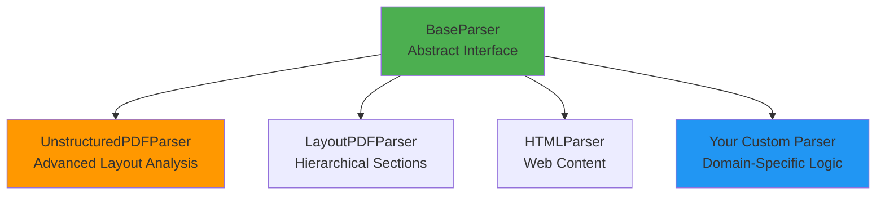

# Custom Parser Development

This guide covers developing custom document parsers for GreenGovRAG, including PDF parsing, HTML parsing, layout-aware parsing, and table extraction.

## Table of Contents

- [Parser Architecture](#parser-architecture)
- [BaseParser Interface](#baseparser-interface)
- [Unstructured.io Parser Configuration](#unstructuredio-parser-configuration)
- [Custom PDF Parser Example](#custom-pdf-parser-example)
- [HTML Parser Example](#html-parser-example)
- [Layout-Aware Parsing](#layout-aware-parsing)
- [Table Extraction](#table-extraction)
- [Testing Parsers](#testing-parsers)

---

## Parser Architecture

**Location**: `/backend/green_gov_rag/etl/parsers/`

**Parser Types**:



**Built-in Parsers**:

| Parser | Use Case | Strengths | File Type |
|--------|----------|-----------|-----------|
| `UnstructuredPDFParser` | Complex PDFs with tables, headers | Best layout detection, table extraction | PDF |
| `LayoutPDFParser` | Hierarchical documents (legislation) | Section hierarchy extraction | PDF |
| `HTMLParser` | Web-based regulations | Clean HTML parsing, link extraction | HTML, XML |

---

## BaseParser Interface

**Planned Interface** (currently implicit):

```python
from abc import ABC, abstractmethod
from typing import Any
from pathlib import Path

class BaseParser(ABC):
    """Abstract base class for document parsers."""

    @abstractmethod
    def parse(self, file_path: str | Path) -> list[dict[str, Any]]:
        """Parse document and return list of chunks with metadata.

        Args:
            file_path: Path to document file

        Returns:
            List of dicts with:
            - content: Text content
            - metadata: Dict with document metadata
        """
        pass

    @abstractmethod
    def supports_file_type(self, file_path: str | Path) -> bool:
        """Check if parser supports this file type.

        Args:
            file_path: Path to document file

        Returns:
            True if parser can handle this file type
        """
        pass
```

**Implementation Requirements**:
1. Return chunks with consistent metadata schema
2. Preserve page numbers and section hierarchy
3. Handle parsing errors gracefully
4. Support chunking strategies

---

## Unstructured.io Parser Configuration

**Module**: `/backend/green_gov_rag/etl/parsers/unstructured_parser.py`

### 1. Installation

```bash
# Install Unstructured.io with PDF support
pip install "unstructured[pdf]==0.10.30"

# Install Tesseract OCR (optional, for scanned PDFs)
sudo apt-get install tesseract-ocr
```

### 2. Basic Configuration

```python
from green_gov_rag.etl.parsers.unstructured_parser import UnstructuredPDFParser

# Hi-res parsing (best quality, slower)
parser = UnstructuredPDFParser(strategy="hi_res")
chunks = parser.parse_with_structure("document.pdf")

# Fast parsing (quick, less accurate)
parser = UnstructuredPDFParser(strategy="fast")
chunks = parser.parse_with_structure("document.pdf")

# Auto parsing (adaptive strategy)
parser = UnstructuredPDFParser(strategy="auto")
chunks = parser.parse_with_structure("document.pdf")
```

### 3. Advanced Options

```python
from unstructured.partition.pdf import partition_pdf

# Full configuration
elements = partition_pdf(
    "document.pdf",
    # Parsing strategy
    strategy="hi_res",              # or "fast", "auto"

    # Table extraction
    infer_table_structure=True,     # Extract table structure
    extract_images_in_pdf=False,    # Skip images (faster)

    # OCR configuration
    ocr_languages="eng",            # Language for OCR
    extract_image_block_to_payload=False,

    # Page tracking
    include_page_breaks=True,       # Track page numbers

    # Chunking
    max_characters=1000,            # Max chunk size
    new_after_n_chars=800,          # Split at this length
    combine_text_under_n_chars=50   # Combine small chunks
)
```

### 4. Parsing Strategies Explained

**Hi-Res Strategy**:
```python
# Best for: Complex layouts, tables, multi-column documents
# Speed: ~5-10 seconds per page
# Accuracy: Highest
# Resource usage: High (uses vision models internally)

parser = UnstructuredPDFParser(strategy="hi_res")
```

**Fast Strategy**:
```python
# Best for: Simple text-heavy PDFs, quick processing
# Speed: ~0.5 seconds per page
# Accuracy: Good for text, may miss complex layouts
# Resource usage: Low

parser = UnstructuredPDFParser(strategy="fast")
```

**Auto Strategy**:
```python
# Best for: Mixed document types, unknown complexity
# Speed: Varies based on detected complexity
# Accuracy: Adaptive

parser = UnstructuredPDFParser(strategy="auto")
```

---

## Custom PDF Parser Example

### 1. Simple Text Extraction Parser

```python
from pathlib import Path
from typing import Any
from langchain_community.document_loaders import PyPDFLoader

class SimplePDFParser:
    """Simple PDF parser using PyPDF."""

    def parse(self, file_path: str | Path) -> list[dict[str, Any]]:
        """Extract text from PDF without layout analysis."""
        loader = PyPDFLoader(str(file_path))
        pages = loader.load()

        chunks = []
        for i, page in enumerate(pages):
            chunk = {
                "content": page.page_content,
                "metadata": {
                    "page": i + 1,
                    "source": str(file_path),
                    "chunk_type": "page"
                }
            }
            chunks.append(chunk)

        return chunks

    def supports_file_type(self, file_path: str | Path) -> bool:
        return str(file_path).lower().endswith(".pdf")
```

### 2. Regulatory Document Parser

```python
import re
from pathlib import Path
from typing import Any
from langchain_community.document_loaders import PyPDFLoader

class RegulatoryPDFParser:
    """Parser optimized for Australian regulatory documents."""

    def parse(self, file_path: str | Path, base_metadata: dict | None = None) -> list[dict[str, Any]]:
        """Parse regulatory PDF with section detection."""
        base_metadata = base_metadata or {}

        loader = PyPDFLoader(str(file_path))
        pages = loader.load()

        chunks = []
        current_section = None
        current_part = None

        for page_num, page in enumerate(pages, 1):
            text = page.page_content

            # Detect Part headings
            part_match = re.search(r'^PART\s+([IVX\d]+)[:\s-]+(.+?)$', text, re.MULTILINE | re.IGNORECASE)
            if part_match:
                current_part = f"Part {part_match.group(1)}: {part_match.group(2).strip()}"

            # Detect Section headings
            section_match = re.search(r'^(\d+(?:\.\d+)*)[:\s-]+(.+?)$', text, re.MULTILINE)
            if section_match:
                current_section = f"Section {section_match.group(1)}: {section_match.group(2).strip()}"

            # Build chunk
            chunk = {
                "content": text,
                "metadata": {
                    **base_metadata,
                    "page": page_num,
                    "chunk_type": "page",
                    "part": current_part,
                    "section": current_section,
                    "section_hierarchy": [
                        h for h in [current_part, current_section] if h
                    ]
                }
            }
            chunks.append(chunk)

        return chunks
```

### 3. Table-Aware Parser

```python
from pathlib import Path
from typing import Any
import pdfplumber

class TableAwarePDFParser:
    """Parser with explicit table extraction using pdfplumber."""

    def __init__(self):
        # pip install pdfplumber
        self.min_table_rows = 2

    def parse(self, file_path: str | Path) -> list[dict[str, Any]]:
        """Extract text and tables separately."""
        chunks = []

        with pdfplumber.open(file_path) as pdf:
            for page_num, page in enumerate(pdf.pages, 1):
                # Extract text
                text = page.extract_text() or ""

                # Extract tables
                tables = page.extract_tables()

                # Add text chunk
                if text.strip():
                    chunks.append({
                        "content": text,
                        "metadata": {
                            "page": page_num,
                            "chunk_type": "text",
                            "has_tables": len(tables) > 0
                        }
                    })

                # Add table chunks
                for table_idx, table in enumerate(tables):
                    if len(table) >= self.min_table_rows:
                        # Convert table to markdown
                        table_md = self._table_to_markdown(table)

                        chunks.append({
                            "content": table_md,
                            "metadata": {
                                "page": page_num,
                                "chunk_type": "table",
                                "table_index": table_idx
                            }
                        })

        return chunks

    def _table_to_markdown(self, table: list[list[str]]) -> str:
        """Convert table to markdown format."""
        if not table or len(table) < 2:
            return ""

        # Header row
        header = table[0]
        separator = ["---"] * len(header)
        data_rows = table[1:]

        # Build markdown
        lines = [
            "| " + " | ".join(str(cell or "") for cell in header) + " |",
            "| " + " | ".join(separator) + " |"
        ]

        for row in data_rows:
            lines.append("| " + " | ".join(str(cell or "") for cell in row) + " |")

        return "\n".join(lines)
```

---

## HTML Parser Example

**Module**: `/backend/green_gov_rag/etl/parsers/html_parser.py`

### 1. Basic HTML Parser

```python
from pathlib import Path
from typing import Any
from bs4 import BeautifulSoup
import requests

class HTMLParser:
    """Parse HTML documents from files or URLs."""

    def parse_file(self, file_path: str | Path) -> list[dict[str, Any]]:
        """Parse HTML file."""
        with open(file_path, 'r', encoding='utf-8') as f:
            html = f.read()

        return self._parse_html(html, source=str(file_path))

    def parse_url(self, url: str) -> list[dict[str, Any]]:
        """Parse HTML from URL."""
        response = requests.get(url)
        response.raise_for_status()

        return self._parse_html(response.text, source=url)

    def _parse_html(self, html: str, source: str) -> list[dict[str, Any]]:
        """Parse HTML content."""
        soup = BeautifulSoup(html, 'html.parser')

        # Remove script and style tags
        for tag in soup(['script', 'style', 'nav', 'footer']):
            tag.decompose()

        # Extract sections
        chunks = []
        sections = soup.find_all(['section', 'article', 'div'], class_=lambda c: c and 'content' in c.lower())

        if not sections:
            # Fallback: extract all text
            text = soup.get_text(separator='\n', strip=True)
            chunks.append({
                "content": text,
                "metadata": {
                    "source": source,
                    "chunk_type": "full_document"
                }
            })
        else:
            # Extract sections
            for idx, section in enumerate(sections):
                # Get section heading
                heading = section.find(['h1', 'h2', 'h3', 'h4'])
                section_title = heading.get_text(strip=True) if heading else f"Section {idx + 1}"

                # Get section text
                text = section.get_text(separator='\n', strip=True)

                chunks.append({
                    "content": text,
                    "metadata": {
                        "source": source,
                        "section_title": section_title,
                        "chunk_type": "section"
                    }
                })

        return chunks
```

### 2. Legislation Portal Parser

```python
class AustralianLegislationParser(HTMLParser):
    """Parser for Australian legislation websites."""

    def parse_url(self, url: str) -> list[dict[str, Any]]:
        """Parse legislation with section detection."""
        response = requests.get(url)
        soup = BeautifulSoup(response.text, 'html.parser')

        chunks = []

        # Find all sections
        sections = soup.find_all(['div', 'section'], class_=lambda c: c and 'section' in c.lower())

        for section in sections:
            # Extract section number
            section_num = section.get('data-section', None)
            if not section_num:
                num_elem = section.find(class_=lambda c: c and 'section-number' in c.lower())
                section_num = num_elem.get_text(strip=True) if num_elem else None

            # Extract section title
            title_elem = section.find(['h1', 'h2', 'h3', 'h4'])
            section_title = title_elem.get_text(strip=True) if title_elem else None

            # Extract text
            text = section.get_text(separator='\n', strip=True)

            # Build clause reference
            clause_ref = f"s.{section_num}" if section_num else None

            chunks.append({
                "content": text,
                "metadata": {
                    "source_url": url,
                    "section_number": section_num,
                    "section_title": section_title,
                    "clause_reference": clause_ref,
                    "chunk_type": "section"
                }
            })

        return chunks
```

---

## Layout-Aware Parsing

### 1. Multi-Column Detection

```python
class LayoutAwarePDFParser:
    """Parser with column detection."""

    def parse(self, file_path: str | Path) -> list[dict[str, Any]]:
        """Parse PDF with column detection."""
        import pdfplumber

        chunks = []

        with pdfplumber.open(file_path) as pdf:
            for page_num, page in enumerate(pdf.pages, 1):
                # Detect columns
                bbox = page.bbox
                width = bbox[2] - bbox[0]

                # Check for two-column layout (heuristic)
                is_two_column = width > 500  # Typical A4 width

                if is_two_column:
                    # Split into left and right columns
                    mid_x = bbox[0] + width / 2

                    left_bbox = (bbox[0], bbox[1], mid_x, bbox[3])
                    right_bbox = (mid_x, bbox[1], bbox[2], bbox[3])

                    left_text = page.within_bbox(left_bbox).extract_text() or ""
                    right_text = page.within_bbox(right_bbox).extract_text() or ""

                    # Add column chunks
                    chunks.append({
                        "content": left_text,
                        "metadata": {
                            "page": page_num,
                            "column": "left",
                            "chunk_type": "column"
                        }
                    })

                    chunks.append({
                        "content": right_text,
                        "metadata": {
                            "page": page_num,
                            "column": "right",
                            "chunk_type": "column"
                        }
                    })
                else:
                    # Single column
                    text = page.extract_text() or ""
                    chunks.append({
                        "content": text,
                        "metadata": {
                            "page": page_num,
                            "chunk_type": "page"
                        }
                    })

        return chunks
```

---

## Table Extraction

### 1. Advanced Table Extraction

```python
class AdvancedTableParser:
    """Extract and structure tables from PDFs."""

    def extract_tables(self, file_path: str | Path) -> list[dict[str, Any]]:
        """Extract tables with structure."""
        import camelot  # pip install camelot-py[cv]

        tables = camelot.read_pdf(str(file_path), pages='all', flavor='lattice')

        table_chunks = []

        for table_idx, table in enumerate(tables):
            # Get table as DataFrame
            df = table.df

            # Convert to markdown
            table_md = df.to_markdown(index=False)

            # Extract table caption (if available)
            caption = self._extract_table_caption(table)

            table_chunks.append({
                "content": table_md,
                "metadata": {
                    "page": table.page,
                    "table_index": table_idx,
                    "chunk_type": "table",
                    "caption": caption,
                    "num_rows": len(df),
                    "num_cols": len(df.columns)
                }
            })

        return table_chunks

    def _extract_table_caption(self, table) -> str | None:
        """Extract table caption from surrounding text."""
        # Implementation depends on document structure
        return None
```

---

## Testing Parsers

### 1. Unit Tests

```python
import pytest
from pathlib import Path
from green_gov_rag.etl.parsers.unstructured_parser import UnstructuredPDFParser

def test_unstructured_parser_basic():
    """Test basic PDF parsing."""
    parser = UnstructuredPDFParser(strategy="fast")
    chunks = parser.parse_with_structure("tests/fixtures/sample.pdf")

    assert len(chunks) > 0
    assert all("content" in chunk for chunk in chunks)
    assert all("metadata" in chunk for chunk in chunks)

def test_unstructured_parser_sections():
    """Test section hierarchy extraction."""
    parser = UnstructuredPDFParser(strategy="hi_res")
    chunks = parser.parse_with_structure("tests/fixtures/legislation.pdf")

    # Check section hierarchy
    section_chunks = [c for c in chunks if c["metadata"].get("section_hierarchy")]
    assert len(section_chunks) > 0

    # Check clause references
    clause_chunks = [c for c in chunks if c["metadata"].get("clause_reference")]
    assert len(clause_chunks) > 0

def test_custom_parser():
    """Test custom regulatory parser."""
    parser = RegulatoryPDFParser()
    chunks = parser.parse("tests/fixtures/nger_guide.pdf")

    assert len(chunks) > 0

    # Verify metadata structure
    for chunk in chunks:
        assert "page" in chunk["metadata"]
        assert "section_hierarchy" in chunk["metadata"]
```

### 2. Integration Tests

```python
def test_parser_integration():
    """Test parser with full ETL pipeline."""
    from green_gov_rag.etl.pipeline import EnhancedETLPipeline
    from green_gov_rag.etl.parsers.unstructured_parser import UnstructuredPDFParser

    parser = UnstructuredPDFParser(strategy="hi_res")
    chunks = parser.parse_with_structure("tests/fixtures/sample.pdf")

    # Test with chunker
    from green_gov_rag.etl.chunker import TextChunker
    chunker = TextChunker(chunk_size=500, chunk_overlap=100)

    chunked = chunker.chunk_with_hierarchy(chunks)
    assert len(chunked) >= len(chunks)  # Should create more chunks

    # Test with embeddings
    from green_gov_rag.rag.embeddings import ChunkEmbedder
    embedder = ChunkEmbedder()

    embedded = embedder.embed_chunks(chunked, batch_size=10)
    assert len(embedded) == len(chunked)
    assert all("embedding" in chunk for chunk in embedded)
```

---

## Best Practices

### 1. Error Handling

```python
def parse_with_fallback(file_path: str) -> list[dict]:
    """Parse with fallback to simpler parser on error."""
    try:
        # Try advanced parser first
        parser = UnstructuredPDFParser(strategy="hi_res")
        return parser.parse_with_structure(file_path)
    except Exception as e:
        logger.warning(f"Hi-res parsing failed: {e}")

        try:
            # Fallback to fast parser
            parser = UnstructuredPDFParser(strategy="fast")
            return parser.parse_with_structure(file_path)
        except Exception as e:
            logger.warning(f"Fast parsing failed: {e}")

            # Final fallback: simple PyPDF
            from langchain_community.document_loaders import PyPDFLoader
            loader = PyPDFLoader(file_path)
            pages = loader.load()
            return [
                {"content": p.page_content, "metadata": p.metadata}
                for p in pages
            ]
```

### 2. Metadata Consistency

```python
# Always include these metadata fields
required_metadata = {
    "page": page_number,
    "chunk_type": "paragraph",  # paragraph, table, header, footer
    "section_title": section_title or None,
    "section_hierarchy": section_stack.copy(),
    "clause_reference": clause_ref or None
}
```

### 3. Performance Optimization

```python
# Parse in batches for large documents
def parse_large_document(file_path: str, max_pages_per_batch: int = 50):
    """Parse large PDF in batches."""
    import PyPDF2

    with open(file_path, 'rb') as f:
        pdf = PyPDF2.PdfReader(f)
        total_pages = len(pdf.pages)

    all_chunks = []

    for start_page in range(0, total_pages, max_pages_per_batch):
        end_page = min(start_page + max_pages_per_batch, total_pages)

        # Extract pages to temp file
        temp_pdf = extract_pages(file_path, start_page, end_page)

        # Parse batch
        chunks = parser.parse(temp_pdf)
        all_chunks.extend(chunks)

    return all_chunks
```

---

## Next Steps

1. **Implement Your Parser**: Extend `BaseParser` for your document type
2. **Test Thoroughly**: Create unit and integration tests
3. **Optimize Performance**: Profile and optimize for large documents
4. **Read ETL Pipeline**: See [architecture/etl-pipeline.md](./architecture/etl-pipeline.md)

---

**Last Updated**: 2025-11-22
